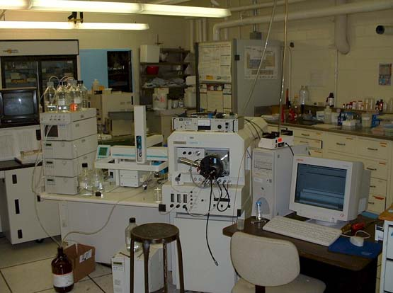

# Biomethoden 1

## Docenten

- Hanna Robin
- Jurre Hageman

## Hoofdpagina

---

*Source: https://commons.wikimedia.org/wiki/File:Quattro_II_triple_quadropole_mass_spectrometer.jpg*
## Inhoud
- [Opdrachten lessen](./opdrachten/opdrachten.md)
- [Uitwerkingen lessen](./uitwerkingen/uitwerkingen.md)

--- 

>This web page is distributed under the terms of the Creative Commons Attribution License which permits unrestricted use, distribution, and reproduction in any medium, provided the original author and source are credited.
>Creative Commons License: CC BY-SA 4.0.

