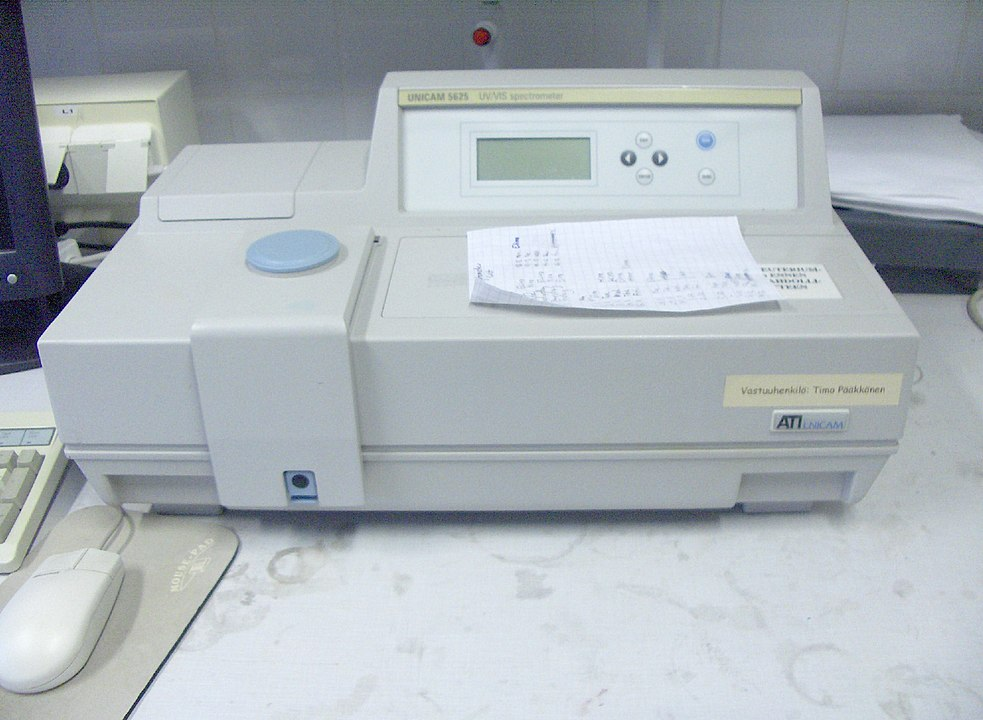
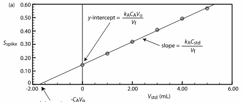
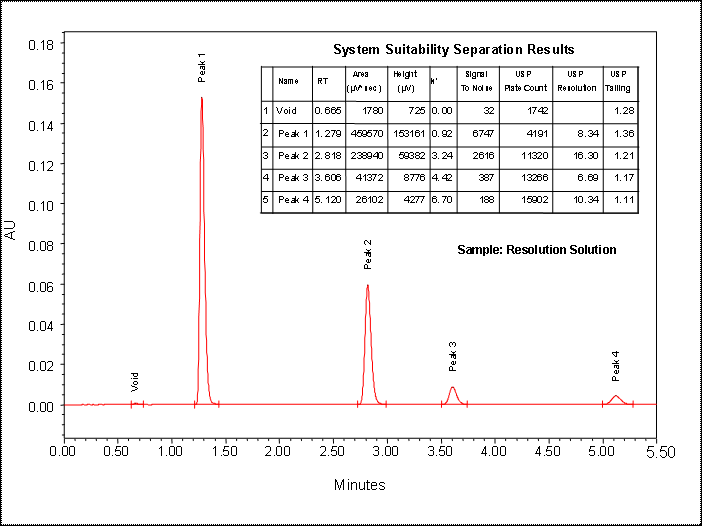

[Terug naar de hoofdpagina opdrachten](../opdrachten.md)

# Opdrachten les 2

*Source: https://en.wikipedia.org/wiki/Spectrophotometry#/media/File:Spektrofotometri.jpg*

## 1. Eén-punts kalibratie
Er wordt een analyse uitgevoerd om het kopergehalte in water te bepalen. De blanco oplossing geeft een intensiteit van 0,2. Een 100 ppm $Cu^{2+}$ oplossing is gemeten onder dezelfde omstandighe-den en heeft een intensiteit van 18,4. Als laatste wordt er een monster gemeten met een onbeken-de concentratie. Hiervan is de emissie intensiteit 12,7.

Bereken concentratie koper in het watermonster.

## 2. Eén-punts kalibratie met IS
Lithium wordt vaak gebruikt als interne standaard bij Natrium metingen. Een 5,00 ppm oplossing van $Li^+$ geeft een emissie signaal van 46,7 eenheden wanneer er gemeten wordt bij 671 nm. Een 5,00 ppm oplossing van een $Na^+$ oplossing geeft een emissie signaal van 35.5 bij 589 nm. Aan een onbekend natrium monster wordt 5.0 ppm $Li^+$ oplossing toegevoegd, dit heeft een emissie signaal van 54.5 bij 589 nm en 21.3 bij 671 nm. 

Bereken de $Na^+$ concentratie van het natriummonster.

## 3.	Interne en externe standaard kalibratie
De concentratie natrium bepaald met lithium (1000 ppm) als interne standaard. De volgende inten-siteiten zijn uit de meting gekomen:

|Conc   Na (ppm)|Intensiteit Na|Intensiteit Li|
|--------------:|-------------:|:------------:|
|0,1            |0,11          |86            |
|0,5            |0,52          |80            |
|1,0            |1,8           |12            |
|5,0            |5,9           |91            |
|10,0           |9,5           |73            |
|Monster        |4,4           |95            |

a.	Bepaal de concentratie natrium in het monster met behulp van een externe kalibratielijn.
b.	Bepaal de concentratie natrium in het monster met behulp van een interne kalibratielijn
c.	Geef een pipeteerschema en de concentratie van de stock-oplossing voor deze kalibratielijn
d.	De natriumstandaard wordt gemaakt met NaCl, bereken hoeveel je moet afwegen om 250 mL te maken.
e.	Heb je voor deze lijn een pre-stock nodig? Minder dan 50 mg kun je niet nauwkeurig afwe-gen op een 4 decimalen balans.

## 4. Standaard additie 1
Bij een methode waar de fosfaatconcentratie in urine wordt bepaald, wordt gebruik gemaakt van standaardadditie. De opwerking is erg simpel: 2 ml urine wordt verdund met water tot 100 mL.
25 mL monsteroplossing wordt gelijk gemeten met een UV spectrometer en de absorptie is 0,428. Daarnaar wordt aan 25 mL monster nog 1 mL 0,05 mg  fosfaatoplossing toegevoegd. Deze oplos-sing geeft een absorptie van 0,517.

Bereken de concentratie fosfaat in urine.

## 5. 5.	Standaard additie 2
Onderstaande opdracht is een oude proef uit thema 5. Maak met de data en gegevens de opdrachten. De data kun je ook vinden als excel file op BB

Inleiding
Natriumnitriet is een zout dat gebruikt wordt als conserveermiddel tegen de bacterie *Clostridium botulinum* (de bacterie die botulisme veroorzaakt) in bijna alle vleeswaren. Nitriet uit vleeswaren vormt een reëel risico. Nitrieten kunnen in de maag met eiwitten reageren tot potentieel kankerverwekkende nitrosamines. Hoge concentraties nitriet kunnen ook reageren met hemoglobine. Het mag niet gebruikt worden in voeding voor kinderen onder de 6 maanden. Kleine kinderen hebben een andere vorm van hemoglobine (HbF), dat veel gevoeliger is voor nitrieten dan normaal hemoglobine. De acceptabele dagelijkse inname bedraagt tot 0.06 mg/kg lichaamsgewicht. 

Monsteropwerking
Weeg ongeveer 5 gram ossenworst of filet americain nauwkeurig af en vul aan tot 200 ml extractie buffer. Breng het extract over in een stomacher. Kneed met de stomacher 2 keer 1 minuut en laat 10 minuten staan bij kamertemperatuur.

IJklijn
Standaard: weeg ongeveer 150 mg natriumnitriet nauwkeurig af en los op in 100 ml demiwater in een maatkolf. Verdun vervolgens deze stock oplossing 100x in een maatkolf met demiwater.
Pipetteer 1 ml monster extract in 14 glazen reageerbuizen. Voeg aan deze buizen standaard toe (in duplo).
Pipetteer daarvoor:  0 - 0.025 – 0.050 – 0.100 – 0.200 - 0.400 en 0.800 ml standaardoplossing in de reageerbuizen. Vul aan tot 9.5 ml met demiwater (bereken dat precies). Voeg 0.5 ml Griess-Romijn-van-Eck reagens toe en vortex kort.

- Meet na 30 minuten de extinctie van de buizen bij 520 nm  

|Buis|A520 |volume standaard (ml)|
|:--:|----:|--------------------:|
|1   |0,043|0,025                |
|1   |0,043|0,025                |
|2   |0,064|0,05                 |
|2   |0,064|0,05                 |
|3   |0,1  |0,1                  |
|3   |0,12 |0,1                  |
|4   |0,191|0,2                  |
|4   |0,212|0,2                  |
|5   |0,312|0,4                  |
|5   |0,32 |0,4                  |
|6   |0,555|0,8                  |
|6   |0,59 |0,8                  |
|7   |0,023|0                    |
|7   |0,019|0                    |

**Opdrachten:**
1.	Bereken de concentratie (molariteit) van de standaardoplossingen en maak een ijklijn.
2.	Bereken de concentratie (mmol/L) nitriet in het monster. 
3.	Bereken hoeveel je van het monster per dag zou mogen binnenkrijgen. De acceptabele dagelijkse inname bedraagt tot 0.06 mg nitriet/kg lichaamsgewicht. 

## 6. Standaard additie 3
Hieronder staat de standaard additie kalibratielijn voor een kwantitatieve analyse van mangaan in een bepaald gesteente. 25 gram steen werd opgelost in 100 ml oplosmiddel. Hieruit is 2 ml geneu-traliseerd in 200 ml $H_2O$ tot het gebruikte monster. Elke kolf bevat 25 ml van het monster en 0; 1,00; 2,00; 3,00; 4,00 en 5,00 ml van een 100,6 mg/l standaard $Mn^{2+}$. Alle kolven zijn aangevuld tot 50,00 ml. 
$S_{spike}$ = signaal 
$V_{std}$ = volume van standaard in elk monster 
De vergelijking van de regressielijn 
y = 0,0854x + 0,1478

Wat is de concentratie $Mn^{2+}$ in het oplosmiddel en hoeveel gram Mn bevatte de steen?

## 7. 100%-methode
Er zitten verschillende suikers in koemelk. Afhankelijk van het ras en de voeding die ze krijgen ver-anderd de samenstellingen van deze melksuikers. Daarnaast wordt er bij optimel suiker en fruitsuiker toegevoegd voor de smaak.

De volgende componenten zijn aangetoond in optimeldrink met mangosmaak: 1 = glucose, 2 = lactose, 3 = fructose en 4 = galactose.

Bereken de samenstelling van de verschillende suikers in optimel.

---

[Terug naar de hoofdpagina opdrachten](../opdrachten.md)

    
