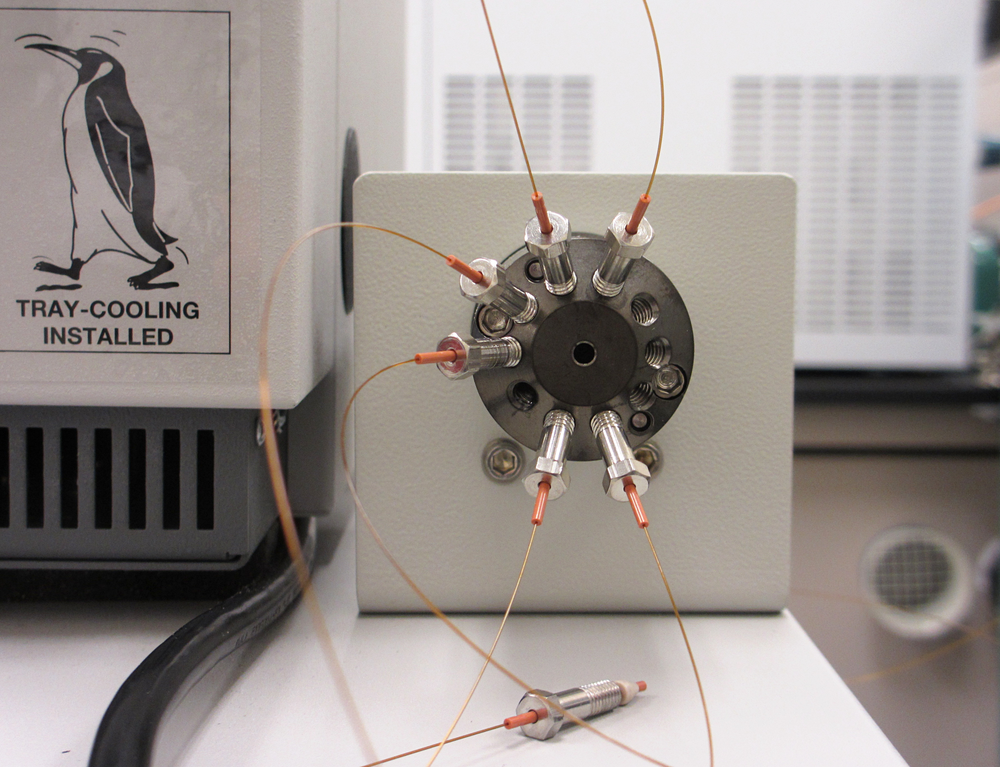
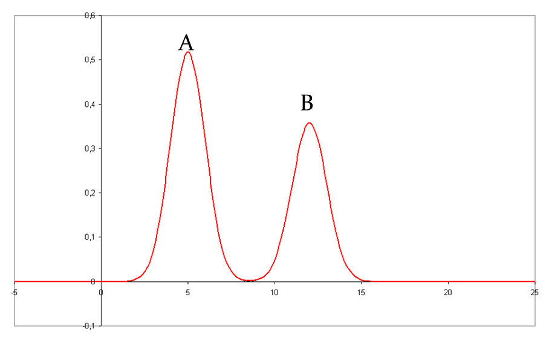
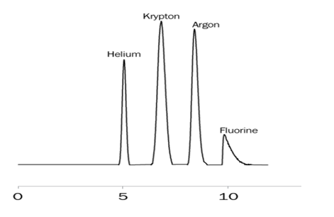
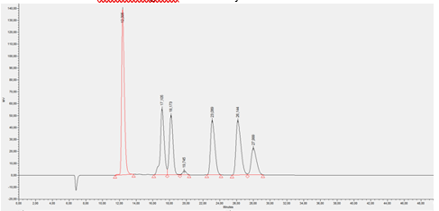
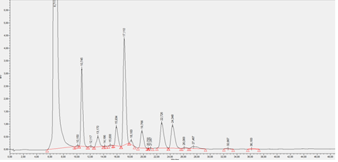

[Terug naar de hoofdpagina opdrachten](../opdrachten.md)

# Opdrachten les 3

*Source: https://en.wikipedia.org/wiki/High-performance_liquid_chromatography#/media/File:Nano-LC_-_(1).jpg*

---

## 1.	Chromatogram interpeteren
Het onderstaande chromatogram is opgenomen op een LC-systeem (vloeistof chromatograaf). Met een C18 kolom van 15,7 cm lang. Twee componenten zijn hierbij gescheiden (A en B). De dode tijd van de  kolom is in een andere meting gemeten met Uracil en komt uit om 0,46 min.

a.	Bereken de netto retentietijden van de twee componenten  
b.	Bereken de retentiefactor van de twee componenten  
c.	Bereken de selectiviteitsfactor  
d.	Bepaal de breedte van de twee pieken  
e.	Bereken het gemiddelde aantal schotels van de kolom  
f.	Bereken het aantal schotel per meter  
g.	Bereken de gemiddelde schotelhoogte in de kolom  
h.	Bereken de resolutie  

---

## 2.	Parameters berekenen opgave
Na een meting van vier componenten op de LC zijn de volgende retentietijden en piekbreedte bepaald. De metingen zijn uitgevoerd op een C8 kolom van 0,35 m en  met een flow van 0,5 mL/min. Het volume van de mobiele fase in de kolom bedraagt 1,45 mL en de stationaire fase 0,4 mL. Bereken hiermee de volgende parameters.

|#	|Tr (min)	|W (min)|
|---|---------|-------|
|Tm	|1,4      | -     |
|C4	|2,8      | 0,35  |
|C5	|3,7      | 0,71  |
|C6	|4,9      | 1,04  |
|C7	|6,1      | 1,58  |

a.	Bereken de netto retentietijden van alle componenten  
b.	Bereken de retentiefactor van alle componenten  
c.	Bereken de selectiviteitsfactor tussen de componenten (C4 en C5, C5 en C6, C6 en C7)  
d.	Bereken het gemiddelde aantal schotels van de kolom  
e.	Bereken het aantal schotel per meter  
f.	Bereken de gemiddelde schotelhoogte in de kolom  
g.	Bereken de resolutie tussen de componenten (C4 en C5, C5 en C6, C6 en C7)  

---

## 3.	Optimalisatie kolomlengte
Op een HPLC met UV-detector worden 2 componenten gemeten. De kolom heeft een lengte van 31,8 cm. In de onderstaande tabel staan de retentietijden weergegeven.

|#	|Tr	|W     |
|---|---|------|
|To	|1,4|	-    |
|A	|2,9|	0,35 |
|B	|4,8|	1,04 |

a.	Bereken de resolutie  
b.	Bereken de selectiviteitsfactor  
c.	Als de resolutie groter is dan 1,5 dan betekent dit dat er meer analysetijd is dan nodig. Hoe lang moet de kolom zijn bij een resolutie van 1,5?  
d.	Wat is de nieuwe retentietijd van stof B?  

---

## 4.	Niet-lineaire chromatografie
In het volgende chromatogram zijn 4 componenten gemeten.

a.	Geef aan welke pieken lineair zijn en welke niet-lineair. Geef tevens de benaming van de piek vorm bij de verschillende pieken.  
b.	Geef minimaal 2 oorzaken van de piekvorm van fluorine.  
c.	Geef in een curve aan wat de verdelingsisoterm is bij helium en fluorine. Hebben de componenten meer voorkeur voor de mobiele of stationaire fase.  

---

## 5.	Van Deemter vergelijking

De van Deemter-curve zegt iets over de optimale flow van de mobiele fase. Tijdens metingen moet de scheiding namelijk zo goed mogelijk zijn, in een zo kort mogelijke analysetijd.

a.	Teken de van Deemter-curve.  
b.	Geef in de curve aan welke drie parameters voor piekverbreding zorgen en benoem deze.  
c.	Geef een  korte uitleg van de drie parameters die zorgen voor piekverbreding.  
d.	Welke parameter heeft het minste invloed bij LC en licht je antwoord toe.  
e.	Leg uit waarom een lage elutiesnelheid tot hoge schotelhoogte leidt.  
f.	Leg uit waarom een hoge elutiesnelheid tot hoge schotelhoogte leidt.  

---

## 6.	Suikermeting op de LC
Een standaard mengsel van glucose en fructose geeft bij elutie op een LC-kolom de volgende karakteristieken:

|#	      |Conc (mg/mL)|	A (cm2)|
|---------|-----------:|--------:|
|Glucose	|1,03        |10,86    |
|fructose	|1,16        |4,37     |

Aan 10,00 mL van een monsteroplossing die een onbekende hoeveelheid glucose bevat wordt onder roeren 12,46 mg fructose toegevoegd. Vervolgens wordt de verkregen oplossing aangevuld tot 25,00 mL.  
Na elutie worden voor glucose en fructose respectievelijk de volgende piekoppervlakken verkregen 5,97 en 6,38 cm2. Het injectievolume is bij alle metingen hetzelfde.  

a.	Fructose is bij de analyse de interne standaard. Aan welke drie voorwaarden moet fructose als interne standaard voldoen?  
b.	Bereken het gehalte glucose (mg/mL) in de monsteroplossing.  

---

## 7.	Bepaling van organische zuren in een bacteriekweek (practicum thema 5)
In het practicum gaan jullie de concentratie van zes verschillende organische zuren bepalen in het supernatant van een bacteriekweek van Clostridium met de LC-DAD met een ion exclusion kolom. Er is 100 mL stock oplossing gemaakt van de zuren en door deze oplossing 10 x te verdunnen krijg je de standaard. Deze standaard wordt gemeten op de HPLC-DAD en met de piekoppervlakten worden gebruikt voor de concentratiebepaling. De stock oplossing is als volgt gemaakt:

|Component	    |massa (g)|
|---------------|--------:|
|Azijnzuur (1 M)|	1,2044  |
|Propionzuur	  |1,0714   |
|Mierenzuur	    |1,4012   |
|Melkzuur	      |1,0716   |
|Boterzuur  	  |1,2816   |
|Iso-boterzuur	|1,0649   |

Het onderstaande chromatogram en tabel zijn van de zuren standaard.  

|#	|Component    	|Retention Time|Area    |
|---|---------------|-------------:|-------:|
|1	|Glucose	      |12,395        |NB      |
|2	|Melkzuur	      |17,105        |1755658 |
|3	|Mierenzuur	    |18,173        |1508108 |
|4	|Azijnzuur	    |19,745        |97394   |
|5	|Propionzuur	  |23,089        |1638827 |
|6	|Iso-Boterzuur	|26,144        |1871673 |
|7	|Boterzuur	    |27,999        |989459  |

a.	Geef de retentietijd van de 6 zuren.  
 
b.	Geef de concentratie (g/L) van de 6 zuren in de standaard oplossing.  

De monsters worden aangezuurd en gefiltreerd voor dat ze gemeten kunnen worden met de LC-DAD. In een eppje wordt 100 uL 4 M HCl, 500 uL monster, 1000 uL millipore gemengd en vervolgens gefiltreerd over whatman FP 30/0.2 CA-s. De volgende chromatogram en oppervlakten zijn verkregen.

|#	|Retention Time	|Area   |
|---|--------------:|------:|
|1	|6,711	        |1246368|
|2	|10,15	        |637    |
|3	|10,745	        |61431  |
|4	|12,117	        |1038   |
|5	|13,17	        |12591  |
|6	|14,186	        |187    |
|7	|15	            |778    |
|8	|15,934	        |19980  |
|9	|17,11	        |112783 |
|10	|18,183	        |3969   |
|11	|19,766	        |20947  |
|12	|20,7	          |14     |
|13	|21,067	        |344    |
|14	|22,726	        |36010  |
|15	|24,348	        |34173  |
|16	|26,083	        |1166   |
|17	|27,467	        |5038   |
|18	|32,667	        |1086   |
|19	|36,183	        |1367   |
 

c.	Welke kwantitatieve methode wordt bij dit experiment gebruikt? gebruik de naamgeving van les 2.  
 
d.	Geef aan wat de oppervlakte van de 6 zuren in het monster zijn.  
 
e.	Bepaal de concentratie van de 6 zuren in het monster (g/L).  
 
f.	Bepaal de concentratie van de 6 zuren in het monster (ppm).  

---

[Terug naar de hoofdpagina opdrachten](../opdrachten.md)

    
