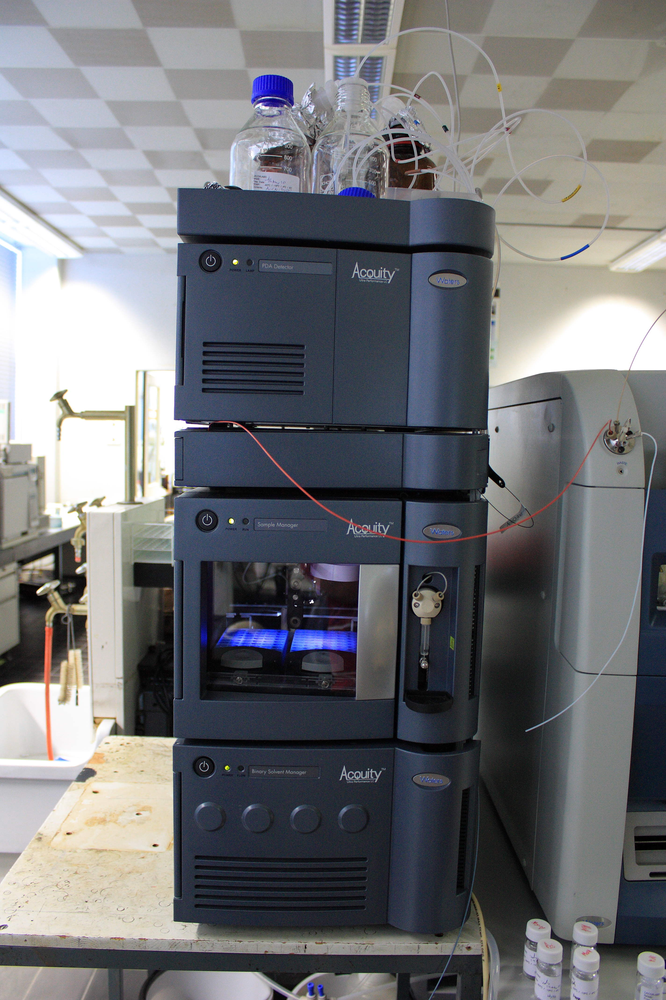
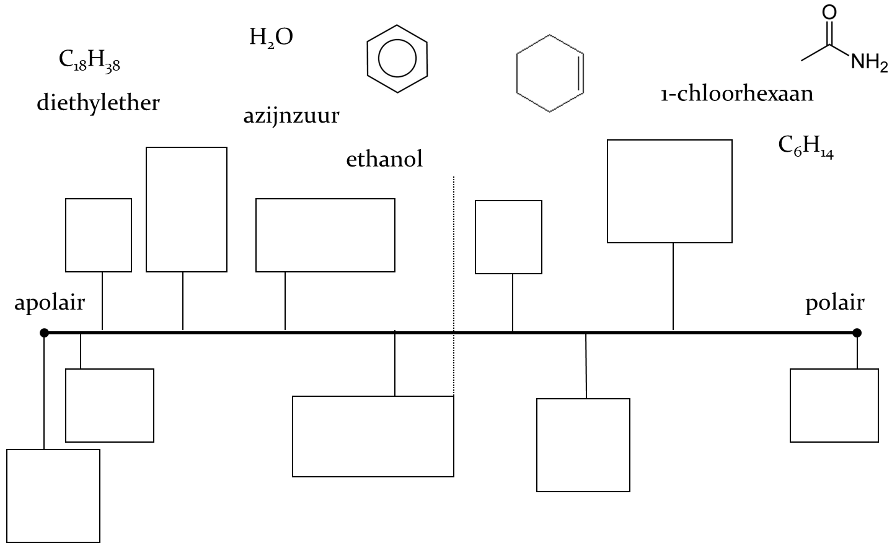
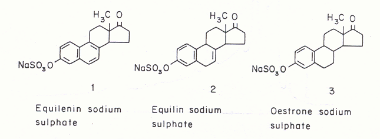
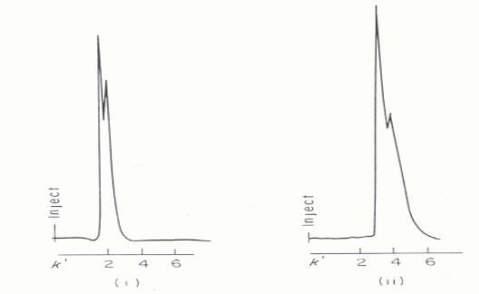
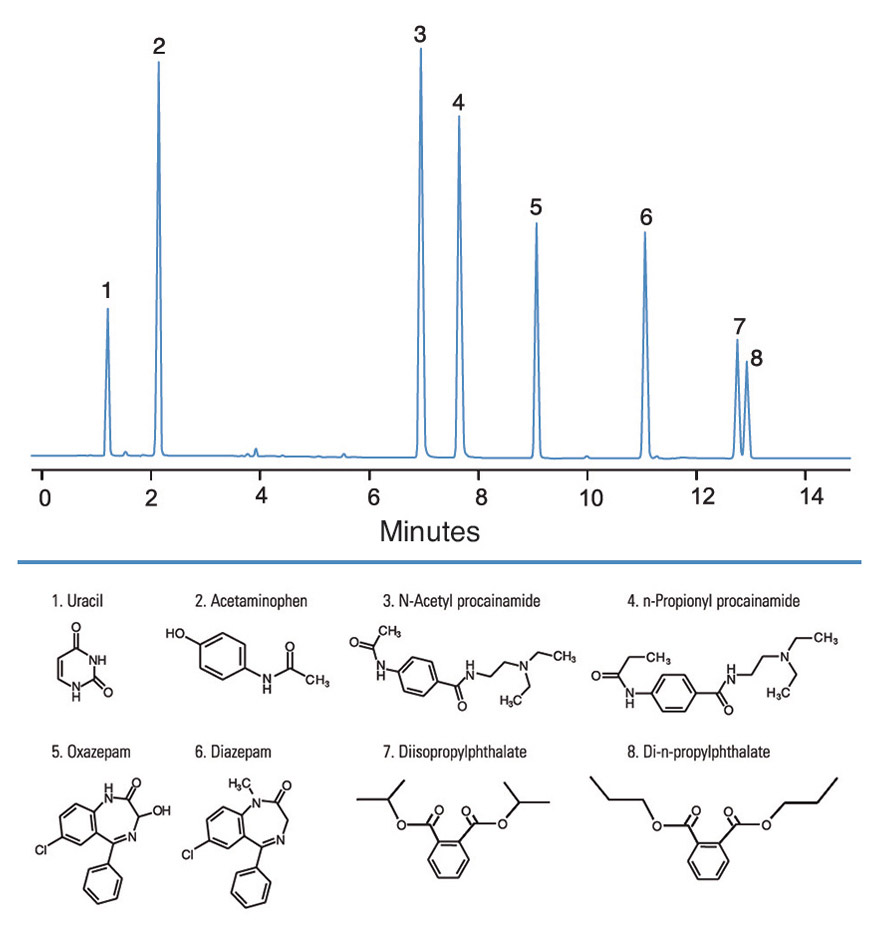

[Terug naar de hoofdpagina opdrachten](../opdrachten.md)

# Opdrachten les 4

*Source: https://nl.wikipedia.org/wiki/UPLC#/media/Bestand:Picture_of_a_UPLC_device.jpg*

---

## 1. Polariteit van componenten 

Vul de onderstaande schema in. 

 
---

## 2.Keuze soort chromatografie
Met welke soort vloeistofchromatografie zou je de onderstaande analyses meten?

a.Zuivering van eiwitten
b.Analyse van bestandsdelen in Cola
c.Zuivering van medicijnen
d.Zuivering van polystyreen in oplossingen
e.Fractionering van aminozuren
f.Scheiden van eiwitten in de molmassa range 60 – 65 kDa

---

## 3.Optimalisatie van de scheiding
Hieronder staan de structuurformules van drie geconjugeerde oestrogenen (steroïden)	

a. De samenstelling van tabletten die deze oestrogenen bevatten (‘de pil’), kan worden bepaald na scheiding van de bestanddelen op een HPLC kolom. Leg uit, aan de hand van de verschillen tussen de gegeven structuurformules, welke LC kolom jij aanraadt voor de beste scheiding.

b. De chromatogrammen i en ii (langs de x-as staat k’ vermeld!) zijn verkregen door elutie van een standaardmengsel oestrogenen op een C18-bonded phase kolom met water/ methanol mengsels van verschillende samenstelling als mobiele fase. Leg uit welk chromatogram is verkregen met de volumeverhouding $CH_3OH/H_2O$ = 35 : 65 en welke met de volumeverhouding $CH_3OH/H_2O$ = 20 : 80. (gebruik in je uitleg het begrip selectiviteit van het fasensysteem).  

---

## 4. Kwantitatieve analyse
Voor een kalibratiemengsel wordt de volgende gegevens verkregen: 10.7 mg alanine, A = 234 mm2;  14.6 mg leucine, A = 304 mm2; 12.5 mg proline, A = 290 mm2.
Het monster geeft een chromatogram met piekoppervlakken van respectievelijk 505, 442 en 287 mm2.

Bereken de samenstelling van het monster volgens:

a. De 100 % methode (neem aan dat alle componenten hetzelfde specifieke oppervlak As hebben).
b.  De externe standaard methode. 

---

## 5. Optimalisatie van LC-analyse
In de onderstaande chromatogram worden benzodiazepinen, kalmering- en slaapmedicatie, gescheiden. Dit wordt gedaan op een HPLC systeem.

a. Vindt deze scheiding plaatst op een NP of RP kolom? Licht je antwoord toe. 

b. De laatste twee pieken (diisopropylphthalate en di-n-propulphthalate) zijn niet goed gescheiden. Welke aanpassingen kun je doen om deze twee pieken beter te scheiden. Noem alle aanpassing en licht die toe.

---

[Terug naar de hoofdpagina opdrachten](../opdrachten.md)

    
