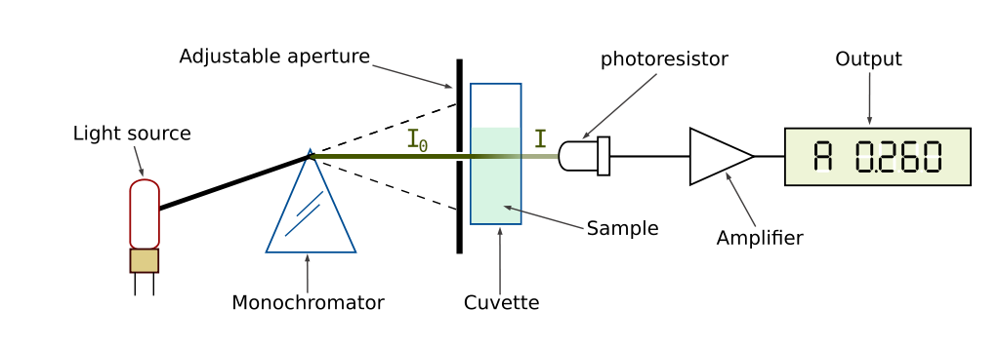

[Terug naar de hoofdpagina opdrachten](../opdrachten.md)

# Opdrachten les 5

*Source: https://en.wikipedia.org/wiki/Spectrophotometry#/media/File:Spetrophotometer-en.svg*

---

## 1. Kwantitatieve analyse 1
De concentratie van een DNA monster (opgelost in water) kan worden vastgesteld met behulp van UV absorptiespectrofotometrie. DNA absorbeert UV licht namelijk zeer efficiënt waardoor de detectiegrens voor DNA  zeer laag is (2,5 ng/μL). De stikstof bevattende basenparen in de nucleotiden vertonen een absorptie maximum bij 260 nm. 
Voor een DNA-oplossing met bekende concentratie (25 μg/mL) wordt de extinctie bij 260 nm gemeten in een cuvet met een optische weglengte van 1,0 cm:
A = 0,852.
40 μL van een DNA monster wordt 5 x verdund en vervolgens wordt de extinctie  gemeten: 0,202.
Bereken de hoeveelheid DNA (uitgedrukt in μg) in 40 μL van het DNA monster.

---

## 2. Wet van Lambert-Beer 1
De molaire extinctiecoëfficiënt van caffeïne ($C_8H_{10}N_4O_2$) bij 278 nm bedraagt 9200 L.mol-1.cm-1.
Hoeveel gram moet je oplossen tot 100 ml oplossing om een transmissie te meten van 50,0 % in een 1,00 cm cuvet? Gegeven: M(caffeïne) = 194.0 g/mol.

---

## 3. Rekenen met blanco’s
Adenine (6-aminopurine) is een organische base met een molmassa van 135 g/mol. De molaire extinctiecoëfficiënt in 0.1 M HCl-oplossing bij 262 nm is 13400 L.mol-1.cm-1.

a. Bereken de extinctie van een oplossing die 5,00 ppm adenine bevat, als gegeven is: 
- de optische weglengte is 1,00 cm;
- de referentie is 0.1 M HCl-oplossing.

b. Gemeten tegen water wordt voor de blanco een transmissie van 94 % gemeten. Bereken de extinctie van de adenine-oplossing als deze tegen water zou zijn ge­me­ten. 

c. Verwacht je dat de molaire extinctiecoëfficiënt in 1 M HCl-oplossing bij 262 nm ook L.mol-1.cm-1 zal bedragen of niet? En in 0.1 M NaOH? Leg uit. 

---

## 4. Wet van lambert-Beer 2
Zinc (II) and the ligand L form a product that absorbs strongly at 600 nm:

$Zn^{2+} (aq)   +   L  \rightleftharpoons ZnL^{2+} (aq)$ 

$λ_{abs} = 600 nm$

Neither zinc(II) nor L absorbs at 600 nm.
As long as the molarity of L exceeds that of zinc (II) by a factor 5, the absorbance (≡ extinction) is dependent only on the cation ($Zn^{2+}$) concentration prior to reaction.
50 mL of a solution that is $1.60 \cdot 10^{-4}$ M in zinc(II) is added to 50 mL of a solution that is $1.00 \cdot 10^{-3}$ M in L. The absorbance of the resulting solution is 0.464 in a 1.00 cm cell at 600 nm.  
Calculate:

a.	The percent transmittance of this solution.

b.	The percent transmittance of this solution in a 2.50 cm cell.

c.	The molar absorptivity ε of the complex.

---

## 5. Kwantitatieve analyse 2 
two-tablet sample of vitamin/mineral supplement weighing 6.08 g was wet-ashed to eliminate organic matter and then diluted to 1.00 dm3. Two 10.00 ml aliquots were then treated with the reagents (see the table) and subsequently analyzed.
Calculate the average weight of iron in each tablet, based upon the following information:

|mL aliquot	 |mL Fe(III)-solution (1.00 ppm)	|mL Ligand (chromophore)	|mL H2O	|Absorbance|
|-----------:|-------------------------------:|------------------------:|------:|---------:|
|10.00	     |0.00	                          |25.00	                  |15.00	|0.492     |
|10.00	     |15.00	                          |25.00	                  |0.00	  |0.571     |

---

## 6. Transmissie 
Gemeten tegen water wordt voor een blanco een transmissie van 88 % en voor de monsteroplossing een transmissie van 37% gevonden.
Bereken de transmissie van de monsteroplossing als direct tegen de blanco zou zijn gemeten.

---

[Terug naar de hoofdpagina opdrachten](../opdrachten.md)

    
