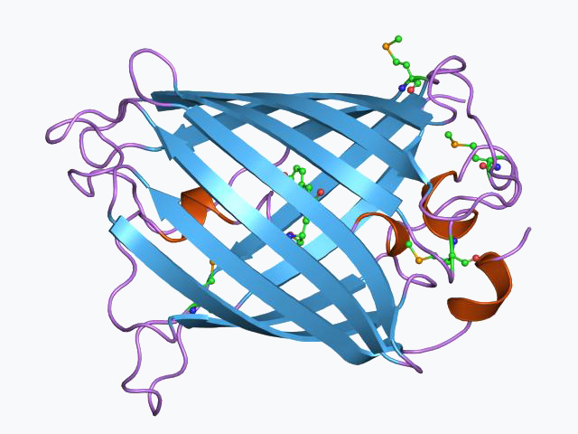

[Terug naar de hoofdpagina opdrachten](../opdrachten.md)

# Opdrachten les 6

*Source: https://en.wikipedia.org/wiki/Green_fluorescent_protein#/media/File:PDB_1ema_EBI.jpg*

---

## 1. Instrument
Leg in eigen woorden uit hoe je een fluorescentie spectrum opneemt van bijvoorbeeld een cuvet gevuld een oplossing GFP. Geef hierbij oa aan, welke golflengtes je gebruikt, welke cuvet, welke lichtbronnen en de positie hiervan, waar de detector zich bevindt.

---

## 2. Jablonski diagram
Teken een Jablonski diagram en geef aan welke processen invloed hebben op de lifetime van fluorescence.

---

## 3. FRET
Leg uit welke factoren bepalen of tussen 2 fluorescente moleculen FRET kan plaatsvinden.

---

[Terug naar de hoofdpagina opdrachten](../opdrachten.md)

    
