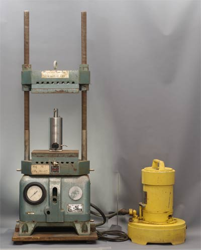

[Terug naar de hoofdpagina opdrachten](../opdrachten.md)

# Opdrachten les 7, 8 en 9

*Source: https://en.wikipedia.org/wiki/French_pressure_cell_press#/media/File:06_fpress_pu.jpg*

---

## 1.Celdisruptie en beschermde stoffen

Vul onderstaande tabel in.

Tijdens de celdisruptie bescherm je de eiwitten tegen:

|Bescherm tegen       |Waar komt het vandaan?|Wat is het probleem?|Wat doe je ertegen?|
|---------------------|----------------------|--------------------|-------------------|
|Proteasen            |                      |                    |                   |
|Zware metalen        |                      |                    |                   |
|Oxidatie	            |                      |                    |                   |
|Verandering van de pH|                      |                    |                   |

---

## Tentamenvragen

Je bent onderzoeker op een laboratorium en je hebt gen X gevonden dat betrokken is bij een proces in de cel, waarin je geïnteresseerd bent. Het proces speelt zich af in het cytoplasma van de cel. Van gen X wil je een aantal zaken bepalen.  

Om te beginnen wil je het eiwit isoleren, zodat je antilichamen tegen het eiwit kunt laten maken. Die heb je later nodig om je vraag te kunnen beantwoorden. Hiervoor moet je eerst je cellen desintegreren. Je besluit de French press te gebruiken.  

a. Beschrijf wat een French press is en hoe deze de cellen desintegreert.  
b. Wat voor buffer gebruik je bij je celdisruptie?  
- I	Welke pH en zoutconcentratie?  
- II	Voeg je nog andere stoffen toe? Waarvoor zijn deze stoffen?  

Je weet van andere onderzoekers dat eiwit X neerslaat bij 65 % zout. Daarom besluit je eiwit X eerst te zuiveren van andere eiwitten door het uit te zouten. 

c. Beschrijf hoe je het uitzouten uitvoert. Hoeveel zout voeg je toe bij de verschillende stappen?

Nadat je eiwit X hebt uitgezouten wil je het weer voorzichtig oplossen en bovendien je zouten verwijderen. Hiervoor voer je een dialyse uit.  
d. Wat is dialyse? Wat voor buffer gebruik je buiten je dialyseslang? Beschrijf wat er gebeurt tijdens de dialyse.  

Om te bepalen of je voldoende eiwitten hebt overgehouden voor een PAGE, bepaal je de eindconcentratie. Je gebruikt hiervoor de Bradford methode.  
e. Beschrijf hoe de Bradford methode werkt. Noem een voordeel en nadeel van de Bradford methode ten opzichte van andere eiwitbepalingen.  

Om het zuiveren makkelijker te maken heb je het eiwit zo gemodificeerd dat er een HisTag aanhangt.  

f. Wat is een HisTag en hoe komt dit aan je eiwit?  
g. Aan welke stof bindt je eiwit als je dit met affiniteitschromatografie zuivert?  
h. Welke stof gebruik je om je eiwit te elueren?  
i. Beschrijf in 4 stappen hoe je je eiwit zuivert met een kolom voor een Histag.  

---

[Terug naar de hoofdpagina opdrachten](../opdrachten.md)

    
