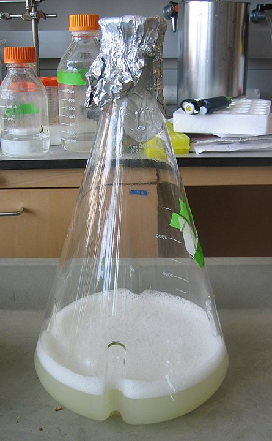

[Terug naar de hoofdpagina opdrachten](../opdrachten.md)

# Opdrachten les 10

*Source: https://upload.wikimedia.org/wikipedia/commons/thumb/4/49/Shakeflask.JPG/445px-Shakeflask.JPG*

---

## Berekenen specifieke activiteit

Je hebt net een cupje van het enzym invertase gekocht.
Het cupje bevat 5 mg eiwit.
Je lost het cupje op in 1 ml buffer.

Invertase activiteit is te meten met een spectrofotometrische bepaling.

Je leest in een protocol:

>Invertase activity can be measured indirectly using 3,5-dinitrosalicylic acid (DNS) reagent. This reagent reacts with reducing sugars to form 3-amino-5-nitrosalicylic acid, which strongly absorbs light at 540 nm.

>The absorbance at 540 nm was recorded for a 1 cm cuvet filled with the following solutions:
>-	0,9 mL substrate solution in buffer
>-	0.1 mL sample solution

Je meetresultaten uit het logboek:

>In 10 minutes the absorbance was increased from 0.000 to 0.970 (increase was linear).
The molar absorption coefficient of the product formed is 34000 M-1 * cm-1.

>Calculate the specific activity of the enzyme in the protein sample. (U/mg protein sample)

---

[Terug naar de hoofdpagina opdrachten](../opdrachten.md)

    
