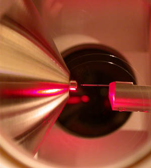
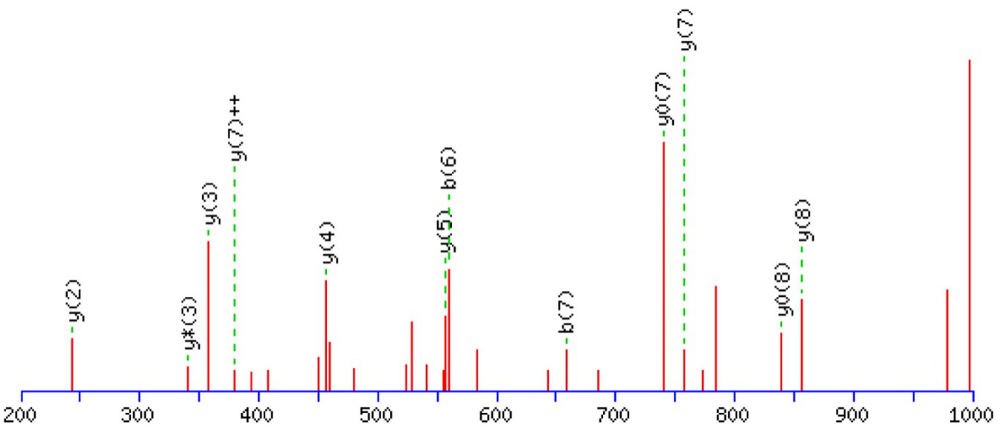

[Terug naar de hoofdpagina opdrachten](../opdrachten.md)

# Opdrachten les 11

*Source: https://en.wikipedia.org/wiki/Electrospray_ionization#/media/File:NanoESIFT.jpg*

---

## 1.Gemiddelde molmassa van eiwit berekenen
Nadat een eiwit geïsoleerd is met antilichamen uit urine, is het geïnjecteerd op een LC-ESI-QQQ systeem.  
Daarnaast is een globale molmassa van 8000 Da bepaald met gel electroforese en size-exclusion chromatografie gaf een molmassa van 8500 Da aan. De volgende massa’s zijn verkregen met de LC-MS: 631.9, 684.0, 745.5 en 819.7 m/z

a. Bereken de lading van de laagste drie m/z waarden

b. Bereken de gemiddelde molaire massa van dit eiwit in Da.

---

## 2.Peptide sequentie 
Wat is de peptide sequentie van de volgende spectra.

In de onderstaande tabel staan de m/z waarden van de pieken in het spectrum

|#	    |m/z  |
|-------|-----|
|Y(2)	  |241.2|
|Y(3)*	|341.2|
|Y(3)	  |355.2|
|Y(7)++	|377.7|
|Y(4)	  |454.3|
|Y(5)	  |553.4|
|B(6)	  |553.5|
|B(7)	  |667.5|
|Y0(7)	|741.4|
|Y(7)	  |755.4|
|Y0(8)	|838.5|
|Y(8)	  |852.5|

---

## 3. Molmassa bepaling van een eiwit met MALDI
Met behulp van een MALDI ionisatie bron is een eiwit bestudeerd. Op het spectra ontstaan 2 pieken met de volgende m/z waarden: 27807 en 13904. Welke mogelijke ionisaties hebben plaatsgevonden?

---

## 4.Opgaven uit het boek
Maak de volgende opdrachten uit het boek:

Example 21.1
Example 21.2
Example 21.3
Example 21.4

---

[Terug naar de hoofdpagina opdrachten](../opdrachten.md)

    
