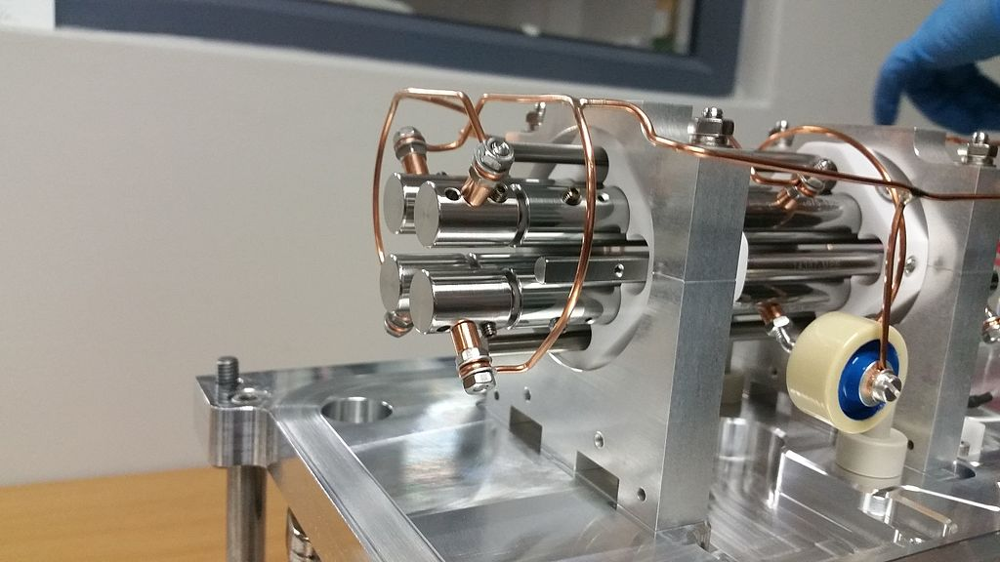
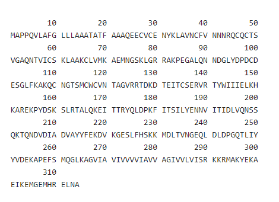
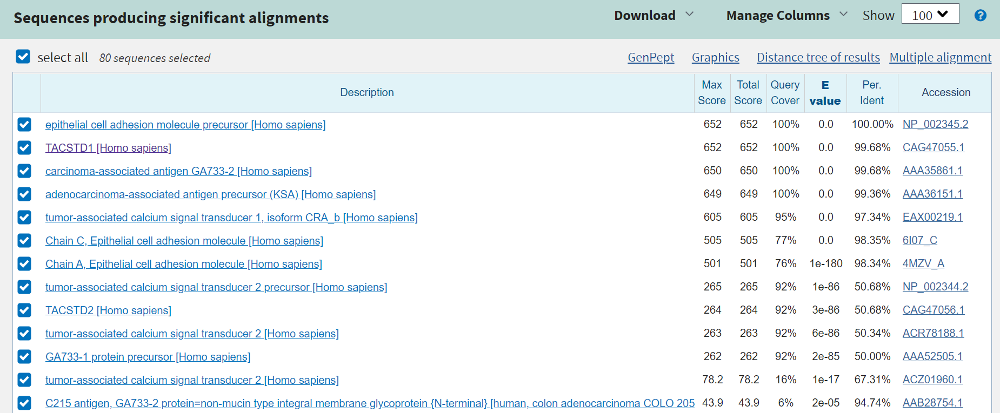
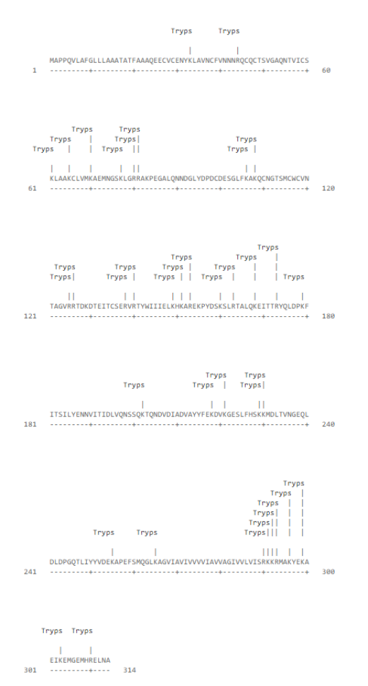
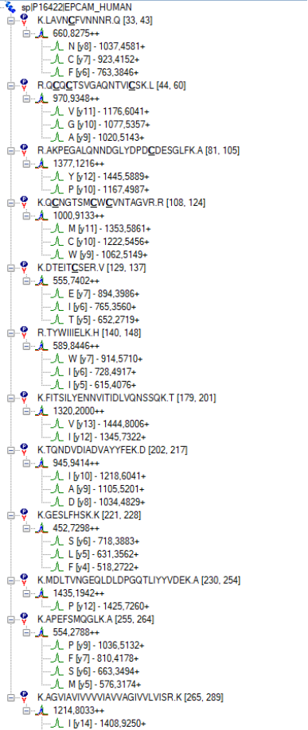

[Terug naar de hoofdpagina opdrachten](../opdrachten.md)

# Opdrachten les 12

*Source: https://en.wikipedia.org/wiki/Triple_quadrupole_mass_spectrometer#/media/File:Quadrupole.jpg*

---

## 1. Methode opzet voor analyse epithelial cell adhesion molecule (EPCAM).
Het epithelial cell adhesion molecule is één van de biomarkers voor longkanker. Je hebt de volgende informatie opgezocht over het eiwit.

NB: Je hebt normaal gesproken een computer nodig voor deze opgaven maar voor het gemak zijn de analyses hieronder te vinden in de bijlagen.

a. Uit hoeveel aminozuren bestaat het epithelial cell adhesion molecule (EPCAM).
b. Hoe vaak wordt het EPCAM eiwit geknipt door trypsine?
c. Welke eiwit lijkt het meest op EPCAM in het menselijk lichaam (gebruik isoform 1, zoek naar paralogen)?
d. Welke peptiden zijn uniek in EPCAM in het menselijk lichaam?
e. Welk peptide kan het best gebruikt worden voor een MS analyse? En welke m/z waarde hoort bij dit peptide?

Bijlagen:

---

[Terug naar de hoofdpagina opdrachten](../opdrachten.md)

    
