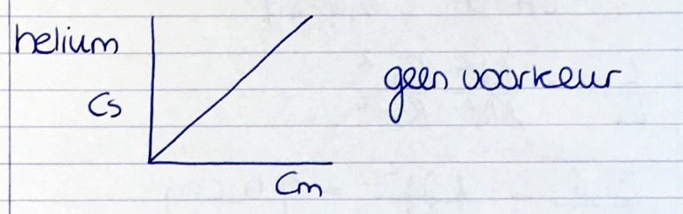

[Terug naar de hoofdpagina uitwerkingen](../uitwerkingen.md)

# Uitwerkingen les 3

---
### Opgave 1

$L_k = 15,7\ cm$  
$t_M = 0,46\ min$  

#### opgave a:
$t_R\ component\ a = t_{Ra} = 5\ min$  
$t_R\ component\ b = t_{Rb} = 12,2\ min$  
$t_R' = t_R - t_M$  
Dus:  
$t_{Ra}' = 5 - 0,46 = 4,54\ min$  
en  
$t_{Rb}' = 12,2 - 0,46 = 11,74\ min$  

#### opgave b:

$𝑘^′=\frac{𝑡_𝑅−𝑡_𝑀}{𝑡_𝑀} = \frac{𝑡′_𝑅}{𝑡_𝑀}$  
dus:  
Voor component a:  
$𝑘_a'=\frac{5−0,46}{0,46} = \frac{5}{0,46} = 9,87$  
Voor component b:  
$𝑘_b'=\frac{12,2−0,46}{0,46} = \frac{11,74}{0,46} = 25,52$  

#### opgave c:
$\alpha =\frac{(𝑡_𝑅)_𝐵−𝑡_𝑀}{(𝑡_𝑅 )_𝐴−𝑡_𝑀}$  
dus:  
$\alpha =\frac{(𝑡_𝑅)_𝐵−𝑡_𝑀}{(𝑡_𝑅 )_𝐴−𝑡_𝑀} = \frac{(t'_R)_B}{(t'_R)_A} = \frac{k' _B}{k'_A} = \frac{25,5}{9,87} = 2,59$  

#### opgave d:
Omzetten van een fysieke afstand op papier (in cm) naar tijd (in min)
$10\ min = 4,9\ cm$  

>let op: deze waarde kan verschillen van jouw opgemeten waarden maar de verhouding blijft altijd gelijk!  

Gemeten:
$W_A = 2,1\ cm$  
$W_B = 2,0\ cm$  
dus:  
$W_A = \frac{10 \cdot 2,1}{4,9} = 4,29\ min$  
$W_B = \frac{10 \cdot 2,0}{4,9} = 4,08\ min$  

#### opgave e:
$𝑁=16\cdot\left(\frac{𝑡_𝑅}{𝑊}\right)^2$  
Voor component A:  
$𝑁_A=16\cdot\left(\frac{𝑡_𝑅}{𝑊}\right)^2 = 16 \cdot \frac{5}{4,29} = 21$  
Voor component B:  
$𝑁_B=16\cdot\left(\frac{𝑡_𝑅}{𝑊}\right)^2 = 16 \cdot \frac{12}{4,08} = 138$  
Gemiddeld aantal schotels:  
$\overline N = \frac{21 + 138}{2} = 79\ schotels$  

#### opgave f:

Aantal schotels per meter:  
$N_{per\ meter} = \frac{N}{l (m)} = \frac{79}{0,157} = 503\ schotels/m$  

#### opgave g:

Gemiddelde Schotel hoogte:  
$H = \frac{L}{\overline N} = \frac{15,7}{79} = 0,199\ cm$  

#### opgave h:

Resolutie:  

$R_S = \frac{2 \cdot (t_{R,B} - t_{R,A})}{W_A + W_B} = \frac{2 \cdot (12,2 - 5)}{4,29 + 4,08} = 1,72$  

---

### opgave 2

#### opgave a, b en c:

Zie [Excel file](./files/les3_uitwerkingen.xlsx) 

#### opgave d:

$\overline N = \frac{1024 + 435 + 355 + 238}{4}=513$  

#### opgave e:
Aantal schotels per meter:  
$N_{per\ meter} = \frac{N}{l (m)} = \frac{513}{0,35} = 1466\ schotels/m$  

#### opgave f:

$\overline H = \frac{L}{N}=\frac{0,35}{513}=0.00068\ m=0,68\ mm$  

#### opgave g:

$R_S = \frac{2 \cdot (t_{R,B} - t_{R,A})}{W_A + W_B}$  

Zie [Excel file](./files/les3_uitwerkingen.xlsx)  

---

### Opgave 3

#### opgave a

$R_S = \frac{2 \cdot (t_{R,B} - t_{R,A})}{W_A + W_B}$  

$R_S = \frac{2 \cdot (4,8 - 2,9)}{0,35 + 1,04} = 2,73$  

#### opgave b

$\alpha =\frac{(𝑡_𝑅)_𝐵−𝑡_𝑀}{(𝑡_𝑅 )_𝐴−𝑡_𝑀}$  
dus:
$\alpha =\frac{4,8-1,4}{2,9-1,4} = 2,27$  

#### opgave c
We nemen aan dat de selectiviteit en capaciteit gelijk blijven.  
Er is  een lineair verband tussen het aantal schotels en de lengte van een kolom.  
De resolutie is proportioneel aan de wortel van het aantal schotels en daarom ook aan de wortel van de lengte van de kolom.  

Als we nu de volgende formule:  

$R_s = \frac{\sqrt{N}}{4}\cdot\frac{\alpha-1}{\alpha}\cdot\frac{k'_b}{1 + k'_b}$  

sterk vereenvoudigen tot:  

$R_s = \sqrt{N}$  

Aantal schotels was proportioneel met de lengte dus:  

$R_s = \sqrt{L}$  
ofwel:  
$L = {R_s}^2$  

Met verhoudingen werken:  

$\frac{L_1}{L_2} = \frac{R_{S1}^2}{R_{S2}^2}$  

$\frac {31,8}{L_2} = \frac{2,73^2}{1,5^2}$  

$2,73^2 \cdot L2 = 31,8 \cdot 1,5^2$  

$L2 = 9,6\ cm$  

#### opgave d  

Deze opgave is ook op te lossen door met verhoudingen te werken:  

Er is een lineair verband tussen de resolutie en retentietijd.  
Dus:  

$\frac{t_{R1}}{t_{R2}} = \frac{R_{S1}}{R_{S2}}$  

$\frac{4,8}{t_{R2}} = \frac{2,73}{1,5}$  

$2,73 \cdot t_{R2} = 4,8 \cdot 1,5$  

$t_{R2} = 2,64\ min$  

---

### opgave 4

#### opgave a
De pieken van componenten met een normale verdeling zijn lineair ofwel helium, krypton en argon.  

Niet lineair is fluorine. Deze piek vertoont tailing.  

#### opgave b

- De te bepalen analyt heeft een sterkere affiniteit met het oplosmiddel dan met de mobiele fase
- Interactie tussen amines en vrij silanol in de stationaire fase
- Interactie van zuren met de silica
- Een lege ruimte in de pakking van de kolom (dood volume)

#### opgave c

Helium: Cs uitgezet als functie van Cm:  
Lijn loopt recht. Geen voorkeur.  

  

Fluorine: Cs uitgezet als functie van Cm:  
Lijn loopt convex. Voorkeur voor stationaire fase.  

---

### Opgave 5

#### opgave a

Zie figuur blz. 204 boek.  

#### opgave b

De `A term` (Eddy diffussie\ook wel "multiple paths" genoemd).  

#### opgave c

- Longitidunale diffussie ofwel de `B term`.  
- Massa transport ofwel de `C term`. Wordt ook wel de transportweerstand of evenwichtintstelling (equilibration time) genoemd.  

#### opgave d

Longitidunale diffussie (`b-term`) heeft bij vloeistofchromatografie weinig invloed. Mobiele fase is een vloeistof. Bewegingssnelheid is klein vergeleken met een gas.  

#### opgave e

Bij een lage $\mu$ (flow rate) speelt de longitidunale diffussie wel een grote rol. Er is immers veel tijd voor. De `B-term` is daarbij dus heel erg hoog.  

$H = A + \frac{B}{\mu}+ C \mu$  

Als B heel erg hoog is en $\mu$ heel laag dan wordt de breuk $\frac{B}{\mu}$ een groot getal.  
Zodoende wordt H erg hoog.  

#### opgave f

Bij een hoge $\mu$ (flow rate) speelt massa transport een grote rol (veel uitwisseling tussen mobiele en stationaire fase). De `C-term` is daarbij dus heel erg hoog. Hierdoor wordt H ook hoog.  

De `C-term` kan laag gehouden worden door kleine particles te gebruiken en de kolom goed vol te pakken met de particles.  

---

### Opgave 6

#### opgave a

Voorwaarden interne standaard:  
- Chemisch gelijksoortig aan glucose
- Ongeveer dezelfde concentratie gebruiken
- Niet gelijk elueren met glucose

#### opgave b

$C_S = 12,46\ mg\ fructose/25\ ml$  
$C_S = 0,498\ mg/ml$  
$C_m = \frac{A_m}{A_{IS,\ m}} \cdot \frac{A_{IS,\ std}}{A_{std}}\cdot C_S$  

Let op dat de concentraties fructose en glucose niet gelijk zijn.  
Hier dient een correctie op plaats te vinden.  
dus:
$C_m = \frac{A_m}{A_{IS,\ m}} \cdot \frac{A_{IS,\ std}}{A_{std}}\cdot \frac{C_{std}}{C_{IS, std}}\cdot C_S$  

$C_m = \frac{5,97}{6,38}\cdot \frac{4,37}{10,86}\cdot \frac{1,03}{1,16}\cdot 0,498 = 0,167\ mg/ml$  

### Opgave 7

#### opgave a

Eerste rij uiteraard geen zuur. Zie dus vanaf rij 2.  

#### opgave b

Zie [Excel file](./files/les3_uitwerkingen.xlsx)  

#### opgave c

Externe standaard methode.  

#### opgave d

Zie [Excel file](./files/les3_uitwerkingen.xlsx)  
Propionzuur is niet terug gevonden.  

#### opgave e

Zie [Excel file](./files/les3_uitwerkingen.xlsx)  

#### opgave f

Zie [Excel file](./files/les3_uitwerkingen.xlsx)  

--- 

[Terug naar de hoofdpagina uitwerkingen](../uitwerkingen.md)

    
