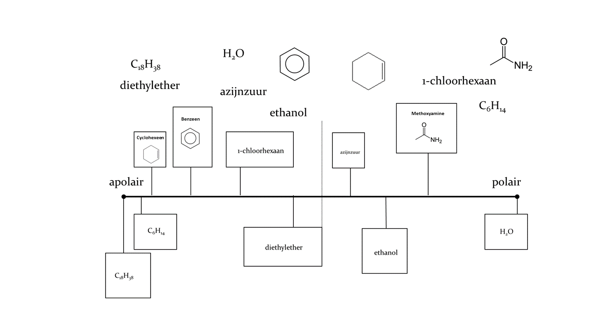

[Terug naar de hoofdpagina uitwerkingen](../uitwerkingen.md)

# Uitwerkingen les 4

---

### Opgave 1

Zie figuur hieronder:  

  

Uitleg bij het figuur:  
- De stippelstreep markeert de grens naar moleculen die H-bruggen kunnen vormen (accepteren en doneren).  
- $H_2O$ is het meest polair.  
- Indien de verhouding NO/CH hoger is, dan is het molecuul polairder.  
- Stoffen die (deels) ioniseren zijn weer polairder.  

Dus:  
Links van de stippellijn:  
Langste CH keten is het meest polair: $C_{18}H_{38}$  
Daarna $C_{6}H_{14}$ (korter).  
Benzeen heeft 3 dubbele bindingen en cyclohexeen 1. De regel is: hoe meer dubbele bindingen des te minder apolair. Benzeen komt dus eerst, gevolgd door cyclohexeen.  
1-chloorhexaan en diethylether: C-O binding is polairder dan C-Cl binding (electronegativiteit). Bovendien heeft 1-chloorhexaan verhoudingsgewijs meer CH. (1-chloorhexaan -> $C_6H_{11}$ en diethylether $C_4H_{10}$). 1-chloorhexaan is dus apolairder en komt eerst, gevolgd door diethylether.  
Rechts van de stippellijn:  
Eerst ethanol: ioniseert niet en laagste verhouding NO/CH.  
Daarna acetamide: ioniseert niet, hogere verhouding NO/CH t.o.v. ethanol  
Daarna azijnzuur: ioniseert gedeeltelijk, heeft daardoor lading en is daardoor polairder.  

---

### Opgave 2

a. Size Exclusion Chromatography (SEC) (gel filtratie)  
b. Partition reversed phase  
c. Adsorptie/partition  
d. Gel permeation chromatography (GPC)  
e. Ion-exchange chromatography (IEC)  
f. Hydrophobic interaction chromatography (HIC)  

---

### Opgave 3

#### opgave a

Reverse phase (RP) kolom want de componenten zijn apolair door de benzeenringen. Een RP kolom remt de apolaire componenten.  

#### opgave b

Mengsels:
- $CH_3OH/H_2O = 35 : 65$  
- $CH_3OH/H_2O = 20 : 80$  

Te voorspellen valt dat een mengsel $CH_3OH/H_2O = 20 : 80$ een grotere k' oplevert op een RP kolom. De mobiele fase is immers polairder dan voor $CH_3OH/H_2O = 35 : 65$.  

Het polariteitsverschil tussen de mobiele fase en de stationaire fase is groter voor $CH_3OH/H_2O = 20 : 80$ als mobiele fase dan voor $CH_3OH/H_2O = 35 : 65$ als mobiele fase.  

De selectiviteit (scheiden van de twee stoffen op de kolom) van het fasensysteem is bij het rechter chromatogram dus hoger. Te zien is dat ook de k'-waarden hoger liggen (zie x-as) en de componenten iets beter gescheiden zijn (al zijn ze nog niet goed gescheiden).  

---

### Opgave 4

#### opgave a

100% methode  
Zie ook de [Excel file](./files/les4_uitwerkingen.xlsx)  

| Stof          | Oppervlak     | Perc. in %  |
| ------------- |:-------------:| -----------:|
| Alanine       | 505           | 40,9        |
| Leucine       | 442           | 35,8        |
| Proline       | 287           | 23,3        |
| Totaal        | 1234          | 100,0       |

#### opgave b

Externe standaard methode  
Zie ook de [Excel file](./files/les4_uitwerkingen.xlsx) 

|Naam           |Oppervlak monster (mm^2)|Oppervlak standaard (mm^2)|Massa standaard (mg)|Massa monster (mg)|
| ------------- |:----------------------:| ------------------------:|:------------------:|-----------------:|
|Alanine        |505                     |                       234|10,7                |              23,1|
|Leucine        |442                     |304                       |14,6                |              21,2|
|Proline        |287                     |290                       |12,5                |              12,4|

---

### Opgave 5

#### opgave a

Op een reverse phase kolom (RP). Uracil is zeer polair. Zie de structuur van [Uracil](https://nl.wikipedia.org/wiki/Uracil). In het chromatogram is duidelijk te zien dat Uracil de kortste retentietijd heeft.  

#### opgave b

- langere kolom (er is echter een kwadratische relatie tot de lengte van de kolom en de resolutie)
- kleinere deeltjes (langere route SF)
- lagere flow (meer tijd voor uitwisseling)
- hogere SF belading (langere route SF)
- meer $H_2O$ in MF (groter verschil in polariteit tussen MF en SF).
- SF apolairder (groter verschil in polariteit tussen MF en SF). 

--- 

[Terug naar de hoofdpagina uitwerkingen](../uitwerkingen.md)

    
