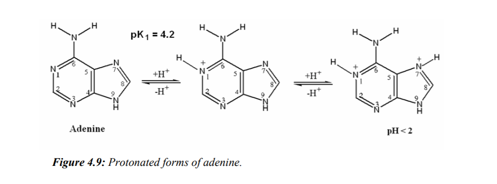

[Terug naar de hoofdpagina uitwerkingen](../uitwerkingen.md)

# Uitwerkingen les 5

---

### Opgave 1

Dit is een voorbeeld van de externe standaard methode.  
$C_m= \frac{A_m}{A_s} \cdot C_{s}$  
dus:  
$C_m= \frac{0,202}{0,852} \cdot 25 = 5,93\ \mu g/mL$  
Monster is 5x verdund dus:  
$5,93 \cdot 5 = 29,6\ \mu g/mL$  
Uitgedrukt in microgram per 40 microliter:  
$29,6 \cdot 0,040 = 1,19\ \mu g/40\ \mu L$  

---

### Opgave 2

$\epsilon_{caffeine} = 9200 \ L \cdot mol^{-1} \cdot cm^{-1}$  
$T = 50\%$  
$M_{caffeïne} = 194.0 \  g/mol$  
$A = ?$  

$A = -log \frac{T\%}{100}$  

$A = -log \frac{50}{100} = 0,301$  

$c = \frac{A}{b \cdot \epsilon}$  

$c = \frac{0,301}{1 \cdot 9200} = 3,272 \cdot 10^{-5} \ mol/L$  

In 100 mL oplossing:  

$3,272 \cdot 10^{-6} \ mol/L$  

Massa afwegen in 100 mL:  

$m = n \cdot M$  

dus:  

$m = 3,272 \cdot 10^{-6} \cdot 194,0 = 6,35 \cdot 10^{-4} \ g$  

---

### Opgave 3

#### opgave a

$\epsilon_{adenine} = 13400 \ L \cdot mol^{-1} \cdot cm^{-1}$
$M_{adenine} = 135 \ g/mol$  
$c = 5 \ ppm$  
$c = 5 \ mg/L$  

$n = \frac{m}{M}$  

$n = \frac{5}{135}= 0,0370 \ mmol/L = 3,70 \cdot 10^{-5} \ mol/L$  

$A = \epsilon \cdot c \cdot b$  

$A = 13400 \cdot 1 \cdot 3,70 \cdot 10^{-5}= 0,496$  

#### opgave b

$T = 94%$  

$A = -log \frac{T\%}{100}$  

$A = -log \frac{94}{100} = 0,027$  

De blanco (0,1 M zoutzuur) geeft dus een extinctie van 0,027
Dit is ten opzichte van water gemeten.  

De extinctie van adenine ten opzichte van water wordt dus:  

$0,496 + 0,027 = 0,523$  

#### opgave c

De molaire extinctiecoëfficiënt is afhankelijk van de chemische matrix.  
Door pH veranderingen kan adenine geprotoneerd en gedeprotoneerd worden (net als bij aminozuren).  
Zie [dit](https://refubium.fu-berlin.de/bitstream/handle/fub188/8054/04_chapter4.pdf?sequence=5&isAllowed=y) artikel.  

  

$pH = -log[H^+]$  
Bij 0,1 M HCl:  
$pH = -log(0,1) = 1$  
Bij 1 M HCL:  
$pH = -log(1) = 0$  

Er wordt geen pKa waarde gepasseerd dus er is geen verandering in protonering te verwachten en daardoor blijft het molecuul gelijk. Geen verandering in de molaire extinctiecoëfficiënt.  

0,1 M NaOH heeft een pH van:  
$pH = 14 - 1 = 13$  

Hierdoor verandert de protoneringsgraad van adenine. Hier is dus wel een verandering voor de molaire extinctiecoëfficiënt te verwachten.  

---

### Opgave 4

#### opgave a

Let op: L is in overmaat (5 maal) en we kunnen dus aannemen dat $Zn^{2+}$ volledig zal worden omgezet.  

$A = -log \frac{T\%}{100}$  
als fractie in plaats van %:  
$A = -log(T)$  

Eerst T isoleren:  

$-log(T) = A$  
$T = 10^{-A}= 10^{-0,464}= 0,344 (fractie)$  
dus:  
$T = 0,344 \cdot 100 = 34,4\%$  

#### opgave b

Absorptie: het licht wordt afgenomen.  
Dit is afhankelijk van de weglengte (dikte cuvet).  
Volgens de wet van lambert beer is er een lineaire relatie tussen de weglengte en de absorptie:  
$A = \epsilon \cdot c \cdot b$  
Let op: dit geldt niet voor de transmissie en de weglengte! Daar is een exponentieel verband.  

De cuvet is nu 2,5 cm en was 1,0 cm.  
De cuvet is dus 2,5 maal zo dik.  
Dus:  
$A = 2,5 * 0,464 = 1,16$  
$-log(T) = A$  
$T = 10^{-A} = 10^{-1,16} = 0,069 (fractie)$  
$T = 0,069 \cdot 100 = 6,9\%$  

#### opgave c
Omdat 2 * 50 mL wordt toegevoegd:  
$c = 0,5 \cdot 1,60 \cdot 10^{-4} = 8,0 \cdot 10^{-5}\ mol/L$  

$A = \epsilon \cdot c \cdot b$  
$\epsilon = \frac{A}{c \cdot b}$  
$\epsilon = \frac{0,464}{8,0 \cdot 10^{-5} \cdot 1} = 5800 \ L \cdot mol^{-1} \cdot cm^{-1}$  

---

### Opgave 5

$c_s = 1\ ppm = 1 \ mg/L$  
Standaard-additie met gelijk volume:  

$c_x = c_s \cdot \left ( \frac {V_s}{V_x} \right )\cdot \left ( \frac {R_x}{R_t - R_x} \right )$  

$c_x = 1 \cdot \left ( \frac {15}{10} \right )\cdot \left ( \frac {0,492}{0,571 - 0,492} \right )= 9,34\ mg/L$  

2 pillen opgelost in 1 L  
In 1 pil zit dus:  
$\frac{9,34}{2}= 4,67\ mg \ Fe$  

---

### Opgave 6

$T_{blanco} = 88\% = 0,88$  
$T_{monster} = 37\% = 0,37$  

Let op: verband Transmissie en concentratie is niet lineair! Je mag de transmissies dus niet van elkaar aftrekken!  

$A = -log \frac{T\%}{100}$  
als fractie in plaats van %:  
$A = -log(T)$  

dus:  

$A_{blanco} = -log(T) = -log(0,88) = 0,056$  

$A_{monster} = -log(T) = -log(0,37) = 0,432$  

Nu de blanco absorptie aftrekken van het monster:  

$A_{corr} = A_{monster} - A_{blanco} = 0,432-0,056 = 0,376$  

En dan de transmissie berekenen:  

$T_{frac} = 10^{-A} = 10^{-1 \cdot 0,376} = 0,420$  
$T\% = 0,420 \cdot 100 = 42\%$  

Alternatieve uitwerking via transmissie:  

$T\% = \frac{P}{P_0} \cdot 100\% = \frac{0,37}{0,88} \cdot 100 \% = 42\%$  

--- 

[Terug naar de hoofdpagina uitwerkingen](../uitwerkingen.md)

    
