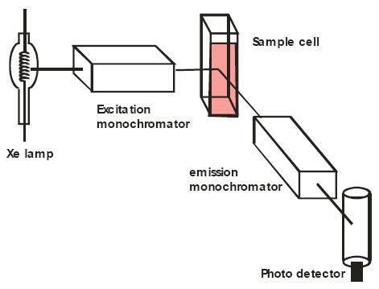
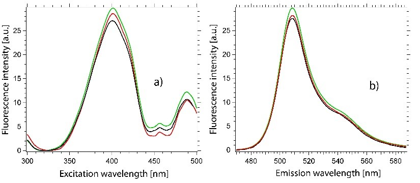
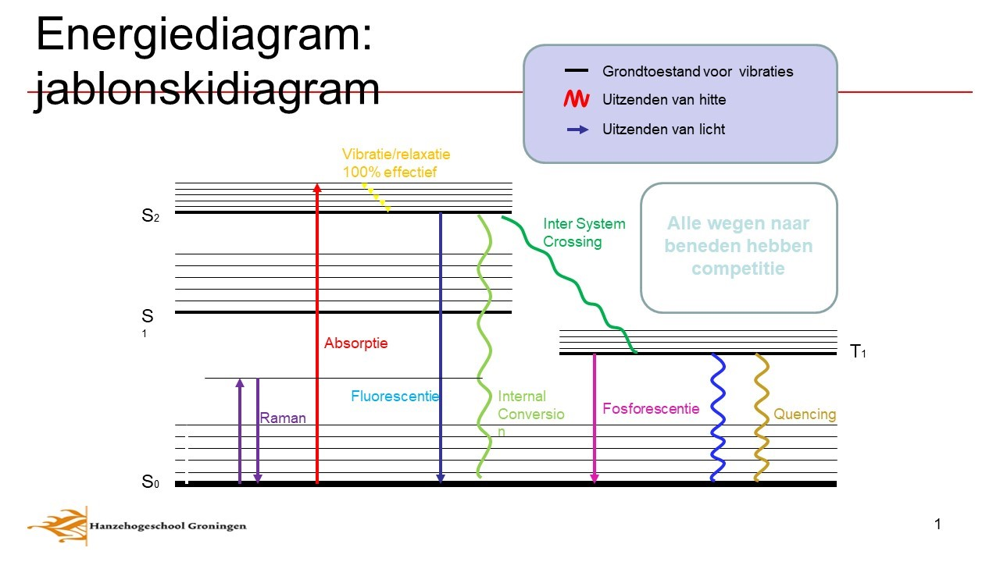
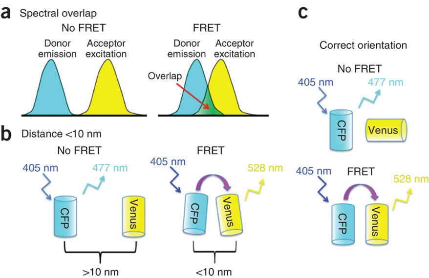

[Terug naar de hoofdpagina uitwerkingen](../uitwerkingen.md)

# Uitwerkingen les 6

---

### Opgave 1

Cuvet (kwarts met aan 4 kanten helder) vullen met een niet te geconcentreerde oplossing GFP eiwitoplossing. Je cuvet komt in het apparaat waar de excitatie een hoek van 90° heeft t.o.v. de detector.

Neem eerst een **absorptiespectrum** (excitatiespectrum) van GFP op. Dit toont bij welke excitatie golflente GFP het meeste fluoresceert. Je kan hierbij van 250-600 nm scannen. 

Met behulp van de excitatie monochromator kan per golflengte het absorptiespectrum "afgetast" worden. Merk op dat de fotodetector geen onderscheid maakt in de golflengte. Deze "vangt" slechts de fotonen. Zie hieronder een voorbeeld van het spectrum van GFP (het betreft wild-type GFP, niet de lab variant) in zwart:
Gebruik nu de golflente met de hoogste **absorptie** voor het **emissiespectrum**. 

Met behulp van de emissiemonochromator kan het emissiespectrum afgetast worden.

---

### Opgave 2

Lifetime $\tau$ (tau) is dependent on factors that cause relaxation:
- fluorescence emission 
- internal conversion
- quencing 
- FRET
- reactions of excited state 
- intersystem crossing

---

### Opgave 3

- Spectrale overlap: overlap tussen emissiespectrum van donor en excitatiespectrum van acceptor. De donor moet een golflengte “uitstralen” die de acceptor kan aanslaan.
- Afstand tussen donor en acceptor. Deze moet kleiner of gelijk zijn aan de forster distance. Deze bedraagt 1-10 nm (10-100 Angstrom).
- Oriëntatie tussen fluorescente groep in donor en acceptor. Bij 2 vrije bewegende moleculen is dit een gemiddelde en is FRET mogelijk. Maar bij rigide systemen mogen de twee niet loodrecht op aan elkaar staan. Maximale FRET vindt plaats bij 2 fluorescente eiwit moleculen die parallel naast elkaar staan.

--- 

[Terug naar de hoofdpagina uitwerkingen](../uitwerkingen.md)

    
