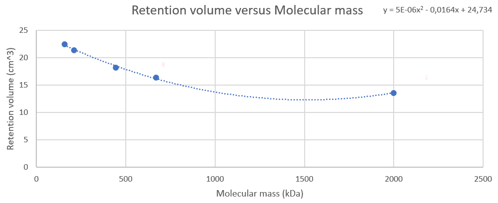

[Terug naar de hoofdpagina uitwerkingen](../uitwerkingen.md)

# Uitwerkingen les 7, 8 en 9

---

### Opgave 1

#### Proteasen:
Waar komt het vandaan?
Bijna elk cel component bevat proteasen maar de meeste proteasen zitten in het lysozoom. 

Probleem:
Als het lysosoom lyseert dan komen de proteasen vrij en zullen het eiwit van interesse mogelijk ook kapot maken.

Oplossing:
Cocktail van protease inhibitors gebruiken.

#### Zware metalen:
Waar komt het vandaan?
Wat een zwaar metaal precies varieert in de literatuur maar algemeen worden ijzer en zink tot de zware metalen gerekend. Er zijn nog vele andere voorbeelden maar deze komen in de mens niet veel voor. IJzer en zink zijn gebonden aan eiwitten (ferritine, hemoglobine, zinc fingers) en kunnen vrijkomen bij de lysis. 

Probleem:
Ionen van de zware metalen kunnen elektronen ontvangen en zijn daardoor oxidatoren. 

Oplossing:
EDTA schermt tweewaardige kationen af (chelatie) en beschermt zo tegen oxidatie.

#### Oxidatie:
Waar komt het vandaan?
De cel bestaat normaal gesproken uit een reducerende omgeving. Na lysis is de omgeving veel meer oxiderend. Onder andere door het minder goed wegwerken van radicalen en het vrijkomen van zware metalen. 

Probleem:
Oxidatie verbreekt onder andere de vrije thiol groepen van cysteïne waardoor zwavelbruggen kunnen ontstaan. 

Oplossing:
Beta-mercaptoethanol en DTT verbreken juist de zwavelbruggen door te reduceren. Ze werken dus als antioxidanten door het reducerende vermogen. 

#### Verandering pH:
Waar komt het vandaan?
De lysosomen van de cel hebben een lage pH (~5) en het cytoplasma heeft een pH van ~7. Na lysis zal de zure inhoud van het lysosoom mengen met de rest. Daarnaast heeft het invriezen/koelen en verwarmen van een lysaat ook een sterke invloed op de pH. Bij temperatuurverlaging zal de pH verhogen (en visa versa). 

Probleem:
Het eiwit van interesse kan denatureren door de pH verandering.

Oplossing:
pH veranderingen zoals door vrijkomen van lysosomale inhoud kan gebufferd worden met een geschikte buffer (juiste pKa, bijvoorbeeld een fosfaat buffer).
De pKa waarde zal door temperatuurveranderingen ook veranderen. Hierdoor is de verandering van pH door een verandering in temperatuur niet te voorkomen met een buffer. Zorg er voor dat je eiwitmengsel niet te veel temperatuurschommelingen doormaakt.

---

### Opgave 2

#### opgave a

Zie [dit filmpje](http://www.youtube.com/watch?feature=player_embedded&v=TjblQAlQBKU) over de French press.  

Celoplossing gaan onder hoge druk door zeer klein opening. Cellen worden sterk samengedrukt. Als de cellen eenmaal door de opening komen valt de druk plots weg. Hierdoor zwellen de cellen zeer snel en breken ze open.

#### opgave b

##### onderdeel I
Bij celdisruptie voor eiwitzuivering gebruik je meestal een buffer met een pH rond de 7.4. Dit komt overeen met de pH van het cytoplasma. Indien je een eiwit uit het lysosoom zuivert dan zorg je er voor dat de pH met de pH van het lysosoom overeenkomt. Een buffer welke goed buffert rond deze pH is een fosfaat buffer (pKa ~ 7.2). Daarnaast is het belangrijk dat een buffer een isotone molariteit heeft. Dit wordt bijvoorbeeld bereikt met 0.9% NaCl. Dit komt overeen met ongeveer 150 mM NaCl (0.9 g/100 ml = 9 g/l, 9/58.5 = 0,154).

##### onderdeel II

- DNAse (maakt DNA kapot)
- Lysozyme (maakt celwand kapot)/ Voor gisten en schimmels kan zymolase gebruikt 	worden.
- Protease inhibitor (voorkomt protease activiteit)

#### opgave c

Je voegt in stap 1 net zoveel zout toe tot je een beetje onder de concentratie zit waarbij jouw eiwit van interesse neerslaat. Dus voor eiwit X is dit bijvoorbeeld 55% zout. Hierna centrifugeer je de oplossing: eiwit X zit in supernatant.
In stap 2 voeg je zoveel zout toe dat de oplossing verzadigd is (een deel van het zout lost niet meer op). Je zit nu op 100%. 
Eiwit X is neergeslagen. Hierna centrifugeer je de oplossing: eiwit X zit in het pellet.

#### opgave d

Bij dialyse giet of pipetteer je je eiwitoplossing in een semi-permeabele zak. Deze zak laat wel de kleine moleculen zoals water en buffer door, maar niet je eiwit. De zak hang je in een bak met de buffer waar je je eiwit graag in wil krijgen (Buffer B). Buffer binnen (Buffer A) en buiten de zak wordt door diffusie vermengd. Aangezien het volume buiten de zak > 10x zoveel is als in de zak, zal het eiwit na de dialyse voor meer dan 90% in buffer B zitten. Eventueel kan de buffer in de bak nog ververst worden.

#### opgave e

Bradford werkt op basis van de Coomassie Blue kleuring. Deze kleurstof bindt aan bepaalde
aminozuren in eiwitten (lys en arg). Het absorptiemaximum is afhankelijk van binding aan eiwit. Zonder binding is het maximum van Coomassie Blue bij 470 en 650 nm. Na binding van eiwit vindt een shift plaats naar 595 nm. Dus, de extinctie bij 595 nm is een maat voor de hoeveelheid eiwit in de oplossing. Met m.b.v. een ijklijn van een bekende eiwitoplossing van zo een schatting worden gemaakt de hoeveelheid eiwit in het monster.
Voordeel: simpele en snelle methode
Nadeel: niet kwantitatief omdat de kleuring afhangt van de aminozuurvolgorde. Eiwitten met veel lys en arg kleuren sterker.

#### opgave f

Minimaal 6 Histidine residuen als “staart” aan de N of C-terminus van je eiwit. Dit wordt gemaakt met recombinante DNA technieken. De coderende sequentie van het DNA wordt veranderd. Hierdoor zal na translatie de N of de C terminus de histidine residuen bevatten.

#### opgave g

Ze binden aan nikkel ionen.

#### opgave h

Dit kan met imidazole. Dit is in feite de restgroep van histidine. De "losse" imidazole gaat in competitie met de imidazole groepen van de his tag.

#### opgave i

1. Kolom equilibreren (laden met juiste buffer, deze bevat een lage concentratie imidazole).
2. Monster opbrengen (ook dit bevat een lage concentratie imidazole, buffer kan afwijken).
3. Wassen met wasbuffer (zelfde als voor de equilibratie, met lage concentratie imidazole).
Eiwitten zonder His-tag verlaten de kolom
4. Elutie met buffer hoge concentratie imidazole. Eiwit met his-tag komt van kolom.

--- 

# Uitwerking opdracht 5.2 van het boek met de ABC formule

## Kalibratielijn tweedegraads polynoom

$y = 5 \cdot 10^{-6} x^2 - 0,0164x + 24,734$

$y = 19,5\ cm^3$
dus:
$19,5 = 5 \cdot 10^{-6} x^2 - 0,0164x + 24,734$
Op 0 stellen:
$0 = 5 \cdot 10^{-6} x^2 - 0,0164x + 24,734 - 19,5$
$0 = 5 \cdot 10^{-6} x^2 - 0,0164x + 5,234$
$a = 5 \cdot 10^{-6}$
$b = -0,0164$
$c = 5,234$

## ABC-formule

$x = \frac{-b\ \pm\ \sqrt{b^2 - 4ac}}{2a}$

$x = \frac{0,0164\ \pm\ \sqrt{-0,0164^2 - 4 * 5 \cdot 10^{-6} * 5,234}}{2 * 5 \cdot 10^{-6}}$

$x = 358\ of\ x =  2922$

Let op: 
Het retentievolume kan niet dalen met oplopende concentratie.  
Eerste snijpunt is daarom correcte antwoord.
Dus:
x = 358 Da

---

[Terug naar de hoofdpagina uitwerkingen](../uitwerkingen.md)

    
