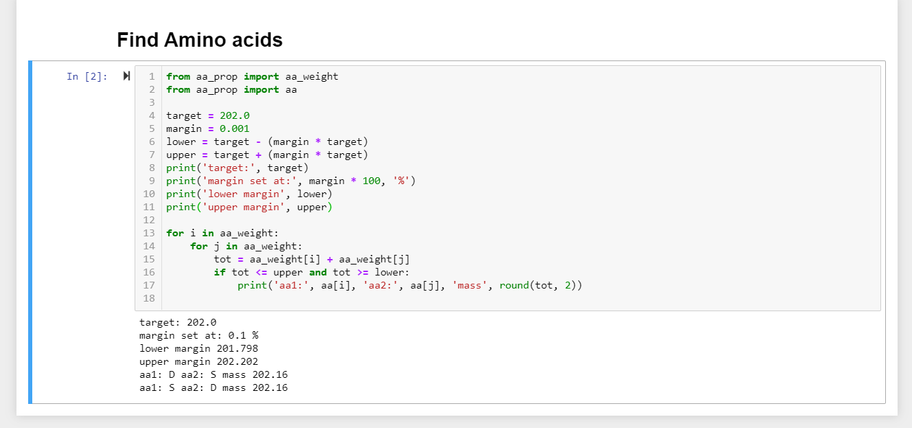
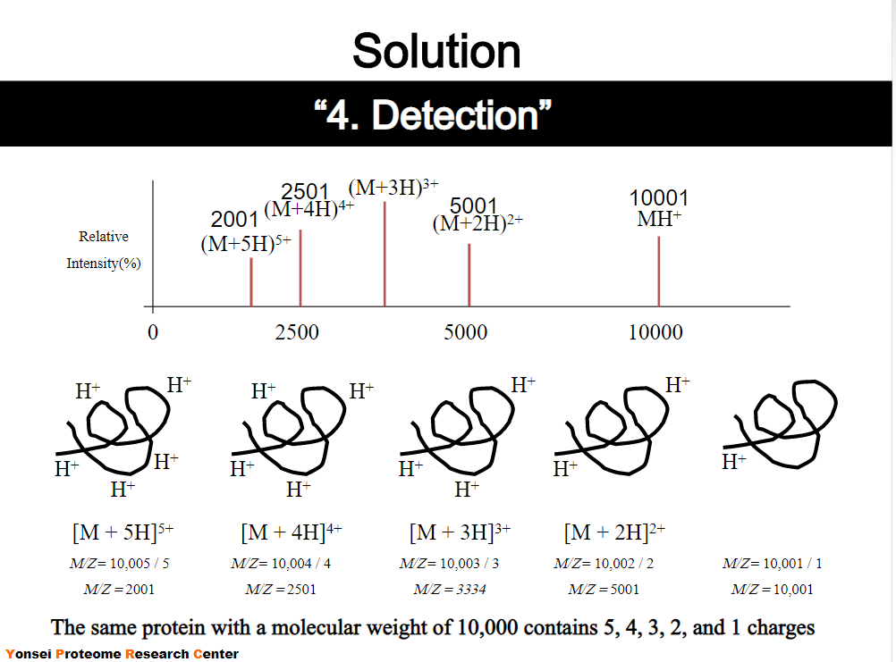

[Terug naar de hoofdpagina uitwerkingen](../uitwerkingen.md)

# Uitwerkingen les 11

---

### Opgave 1
De volgende m/z ratio's zijn gevonden:  
631.9, 684.0, 745.5 en 819.7  
Laagste 3 waarden bepalen:  
631.9, 684.0, 745.5  
dus:  
m2 = 819,7  
m1 - 1 bepalen  
m2 - m1 bepalen  
$n_2$ bepalen:  

$n_2 = \frac{m_1-1}{m_2-m_1}$  
$M_w= n_2 \cdot (m_2-1)$  
Zie de [Excel sheet](./files/les11_uitwerkingen.xlsx).
De uitkomst staat ook hieronder:  

|m/z	|m1-1	|m2-m1	|$n_2$	 |z	 |m2-1	|Mw (Da)|
|-------|-------|-------|----|---|-------|-------|
|819,7  |	    |    	|	 |9  |       |	     |	
|745,5  |744,5  |74,2   |10,0|10 |818,7  |8214,6 |
|684,0  |683,0  |61,5   |11,1|11 |744,5  |8268,2 |
|631,9  |630,9  |52,1   |12,1|12 |683	 |8270,7 |

De z-waarde `9` is er bij geplaatst omdat de z waarde een oplopende sequentie heeft.  

De gemiddelde $M_w$ waarde is:  

$\overline {M_w}= \frac{8214,6 + 8268,2 + 8270,7}{3} = 8251,2 \ Da$  

---

### Opgave 2

Eerst de Y-fragmenten bij elkaar zoeken:  
Zie ook de Excel file.  

|y-fragement	|m/z	|$\Delta$ m/z|aminozuur  |
|---------------|-------|------------|-----------|
|y1             |?      |            |           |
|               |       |?           |?          |
|y2	            |241,2  |            |           |
|               |       |114         |N          |
|y3	            |355,2  |            |           |
|               |       |99,1        |V          |
|y4	            |454,3  |            |           |
|               |       |99,1        |V          |
|y5	            |553,4  |            |           |
|               |       |            |?          |
|y6             |?      |            |           |
|               |       |            |?          |
|y7	            |755,4  |            |	         |
|               |       |97,1        |P          |
|y8	            |852,5  |	           |           |

Let op dat y6 mist.  
We weten alleen dat $\Delta m/z$ voor y7 - y5 = 220.  

We weten daarnaast ook de $\Delta m/z$ voor b7-b6:  
$\Delta m/z _{\ b7-b6} = 667,5 - 553,5 = 114$  
114 komt overeen met N  
Dit klopt met y2-y3. Deze was ook 114.  

Deze kunnen we invullen:  

|y-fragement|m/z  |$\Delta$ m/z|aminozuur|$\Delta$ m/z|m/z  |b-fragment|
|-----------|-----|------------|---------|------------|-----|----------|
|y1         |?    |?           |         |            |     |b8        |
|           |     |            |?        |            |     |          |
|y2	        |241,2|            |         |            |667,5|b7        |
|           |     |114         |N        |114         |     |          |
|y3	        |355,2|	           |         |            |553,5|b6        |
|           |     |99,1        |V        |            |     |          |
|y4	        |454,3|	           |         |            |     |b5        |
|           |     |99,1        |V        |            |     |          |
|y5	        |553,4|	           |         |            |     |b4        |
|           |     |            |?        |            |     |          |
|y6         |?    |            |         |            |b3   |          |
|           |     |            |?        |            |     |          |
|y7	        |755,4|	           |         |            |b2   |          |
|           |     |97,1        |P        |            |     |          |
|y8	        |852,5|	           |         |            |b1   |          |

Verder weten we:  
We weten alleen dat $\Delta m/z$ voor y7 - y5 = 220.  

Kijken wat past (puzzelen)  
Welke twee aminozuren zijn samen 220 Da?  
Of met computer programmatje (hoef je uiteraard niet te kunnen):  

  

De meest waarschijnlijke mogelijkheden zijn dus (voor deze cutoff):  

D en S  
S en D  

Dus sequentie peptide is:  

?NVV[S/D][S/D]P  

Maar let op dat dit van C-terminus naar N-terminus is.  
De regel is dat we de sequentie noteren van N-terminus naar C-terminus dus:  

P[S/D][S/D]VVN?  

---

### Opgave 3

Allereerst nog wat uitleg over de m/z ratio.  
`m` staat voor massa en `z` staat voor de lading door ionen. Bij MALDI wordt een electron weggenomen waardoor een geladen ion met enkele lading ontstaat.  
Als twee electronen weggenomen worden dan ontstaat een dubbel geladen ion. Het aantal electronen dat verwijderd is correspondeert dus met de lading. m/z staat dus voor de massa gedeeld door de lading ofwel de massa tot lading ratio. Doordat het een ratio betreft zijn er meerdere mogelijkheden die dezelfde m/z waarde opleveren. Immers: 10/2 = 5 is immers gelijk aan 20/4 = 5.  

Zie onderstaand figuur. Hierbij is een MALDI-spectrum te zijn van een eiwit met een Mw van 10000.  

  

Er zijn dus meerdere mogelijkheden maar bepaalde combinaties komen het meest voor.  

Zo komen de volgende combinaties vaak voor:  
De pieken bestaan uit (optie 1):  
$[M + H]^+$ en $[M + 2H]^{2+}$  
Of de pieken bestaan uit (optie 2):  
$[2M + H]^+$ en $[M + H]^+$  

Ik zal met een eenvoudig voorbeeld laten zien dat dit 2 dezelfde m/z waarden geeft.  

Stel $M_w$ van een referentie eiwit is 1000 Da:  

Optie 1:  
$[M + H]^+$:  
$m/z = 1000 + 1 = 1001$ Dit is piek 2  
$[M + 2H]^{2+}$  
$m/z = \frac{1000 + 2}{2} = 501$ Dit is piek 1 (komt eerder bij detector aan)  

Optie 2:  
$[2M + H]^+$:  
$m/z = 2 \cdot 500 + 1 = 1001$ Dit is piek 2  
$[M + H]^+$:  
$m/z = 500 + 1 = 501$ Dit is piek 1 (komt eerder bij detector aan)  

We weten dat optie 1 correct is omdat we een referentie eiwit hebben gebruikt maar we zien dat optie 2 dezelfde uitslag geeft!  
We kunnen bij een analyse van een onbekend eiwit dus niet zeker van optie 1 zijn. Optie 2 is ook mogelijk!  

In de opgave staat beschreven:  

$m/z_{piek1} = 13904$  
$m/z_{piek2} = 27807$  

Welke mogelijke ionisaties hebben plaatsgevonden?  

Optie 1:  

De pieken bestaan uit:  
$[M + H]^+$ en $[M + 2H]^{2+}$  

$[M + H]^+$:  
$m/z = 27807$  
$m/z = 27806 + 1 = 27807$  
ofwel:  
$M_w= 27807 - 1 = 27806\ Da$  

$[M + 2H]^{2+}$:  
$m/z = 13904$  
$m/z = \frac{27806 + 2}{2} = 13904$  
ofwel:  
$M_w = 13904 \cdot 2 -2 = 27806 \ Da$  

Optie 2:  

De pieken bestaan uit:  
$[2M + H]^+$ en $[M + H]^+$  

$[2M + H]^+$:  
$m/z = 27807$  
$m/z = 2 \cdot 13903 + 1 = 27807$  
ofwel:  
$M_w = \frac{27807 - 1}{2} = 13903 \ Da$  

$[M + H]^+:$  
$m/z = 13904$  
$m/z = 13903 + 1 = 13904$  
ofwel:  
$M_w = 13904 -1 = 13903 \ Da$  

---

### Opgave 4

Zie uitwerkingen boek.  

--- 

[Terug naar de hoofdpagina uitwerkingen](../uitwerkingen.md)

    
