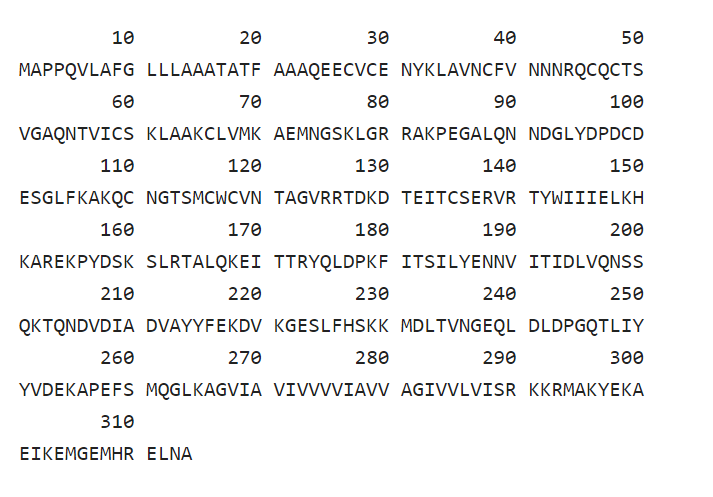
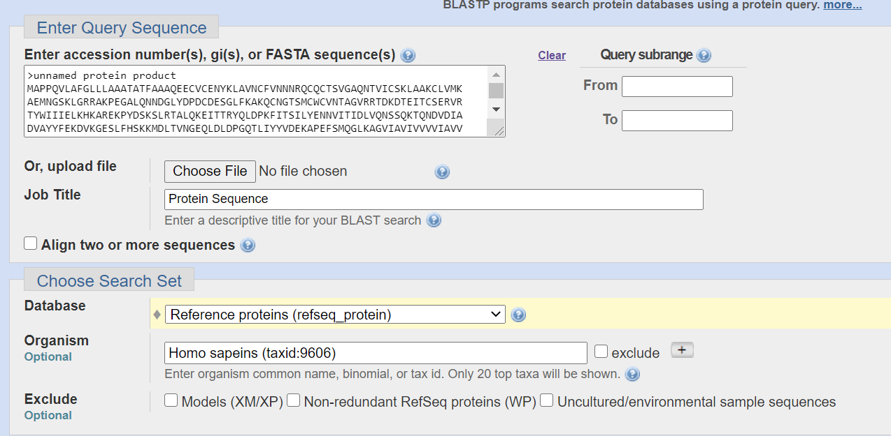
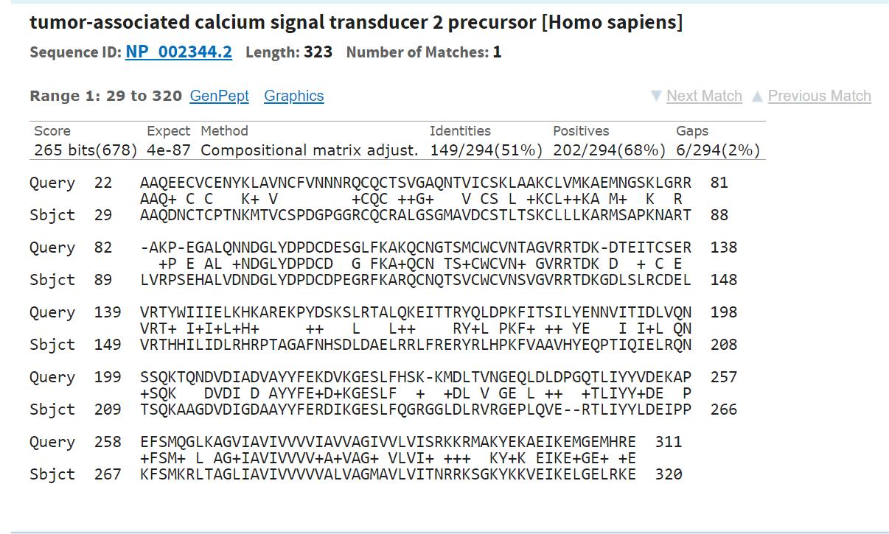
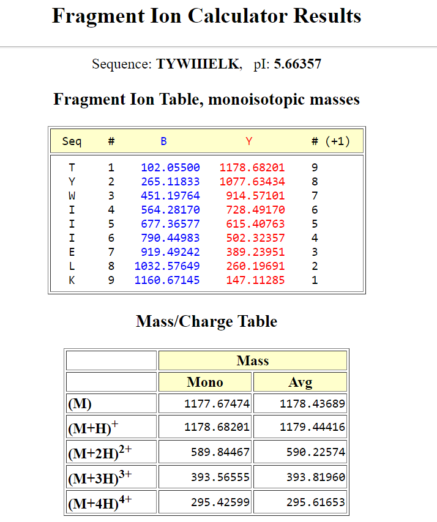

[Terug naar de hoofdpagina uitwerkingen](../uitwerkingen.md)

# Uitwerkingen les 12

---

### Opgave 1

#### opgave a

Zie deze [link naar uniprot](https://www.uniprot.org/uniprot/P16422)  
Uniprot wordt ook besproken bij de Bio-informatica lessen. 

Screenshot van een deel van de sequentie van isoform 1:  

  

De lengte is: 314 aminozuren.  

#### opgave b

Zie deze [link naar de Peptide Cutter](https://web.expasy.org/peptide_cutter/)  

Stel deze zo in dat alleen een Trypsine digest uitgevoerd wordt.  

Resultaat:  

|Name of enzyme|No. of cleavages|Positions of cleavage sites                             |
|--------------|----------------|-------------------------------------------------------------|
|Trypsin       |37            	|33 44 61 65 70 77 80 81 106 108 125 126 138 140 149 151 153 160 163 168 173 179 202 218 221 229 230 255 265 290 291 292 293 296 299 303 310|

#### opgave c

BlastP gebruiken tegen menselijk refseq_protein eiwit databank. De mens is geheel gesequenced en uitstekend geannoteerd. Om minder "troep" te zien is het raadzaam om de refseq_protein database te gebruiken.  

Het gaat hier om het zoeken naar een paraloog (homoloog eiwit in hetzelfde organisme) en niet naar andere isoformen van hetzelfde polypeptide!  

Blast wordt uitgebreid behandeld bij Bio-informatica.  

Overzicht van Blast settings:  

  

Overzicht van het Blast resultaat:  

Antwoord: tumor associated calcium signal transducer 2 [Homo sapiens (human)]  
Ook wel bekend als: TACSTD2.  

Screenshot van de alignment:  

  

#### opgave d

Dus de peptiden gegenereerd na digest:  
Deze zijn hadmatig uit Peptide cutter te halen.  
Ik heb er (voor het gemak) een Python scriptje voor gebruikt om de volledige lijst te geven:  

1 MAPPQVLAFGLLLAAATATFAAAQEECVCENYK 33  
34 LAVNCFVNNNR 44  
45 QCQCTSVGAQNTVICSK 61  
62 LAAK 65  
66 CLVMK 70  
71 AEMNGSK 77  
78 LGR 80  
81 R 81  
82 AKPEGALQNNDGLYDPDCDESGLFK 106  
107 AK 108  
109 QCNGTSMCWCVNTAGVR 125  
126 R 126  
127 TDKDTEITCSER 138  
139 VR 140  
141 TYWIIIELK 149  
150 HK 151  
152 AR 153  
154 EKPYDSK 160  
161 SLR 163  
164 TALQK 168  
169 EITTR 173  
174 YQLDPK 179  
180 FITSILYENNVITIDLVQNSSQK 202  
203 TQNDVDIADVAYYFEK 218  
219 DVK 221  
222 GESLFHSK 229  
230 K 230  
231 MDLTVNGEQLDLDPGQTLIYYVDEK 255  
256 APEFSMQGLK 265  
266 AGVIAVIVVVVIAVVAGIVVLVISR 290  
291 K 291  
292 K 292  
293 R 293  
294 MAK 296  
297 YEK 299  
300 AEIK 303  
304 EMGEMHR 310  
311 ELNA 314  

Verschillen zijn o.a. te vinden in de volgende peptiden (gegenereerd door eerder geanalyseerde trypsine digest):  
Let op: Trypsine knipt na een K of R.  
Bijvoorbeeld: peptide 141-149  

#### opgave e

Zoek naar een peptide:  
- dat niet te groot is (bijv 10 aa) na Trypsine digestie  
- dat verschillen bevat t.o.v. een paraloog eiwit.  

Bijvoorbeeld:  
141 TYWIIIELK 149  
222 GESLFHSK 229  
266 AGVIAVIVVVVIAVVAGIVVLVISR 290  

Deze peptiden kun je analyseren met:  
Zie deze [Fragment Ion Calculator](http://db.systemsbiology.net:8080/proteomicsToolkit/FragIonServlet.html)  

Hier is een voorbeeld te zien van de analyse van het peptide: 141 TYWIIIELK 149:  

   

De $[M + 2H]^{2+}$ waarde van het precursorion is dus 589,8 Da.  
Verder is ook de fragment ion table te zien van de y- (ammonium ionen) en b (acylium ionen) fragmenten te zien.  

Resultaat voor peptide 222 GESLFHSK 229:  
$[M + 2H]^{2+}$ = 452,7 Da  
Fragment Ion Tabel niet verder getoond.  

Resultaat voor peptide  
266 AGVIAVIVVVVIAVVAGIVVLVISR 290:  
$[M + 2H]^{2+}$ = 1214,8 Da  
Fragment Ion Tabel niet verder getoond.  

--- 

[Terug naar de hoofdpagina uitwerkingen](../uitwerkingen.md)

    
